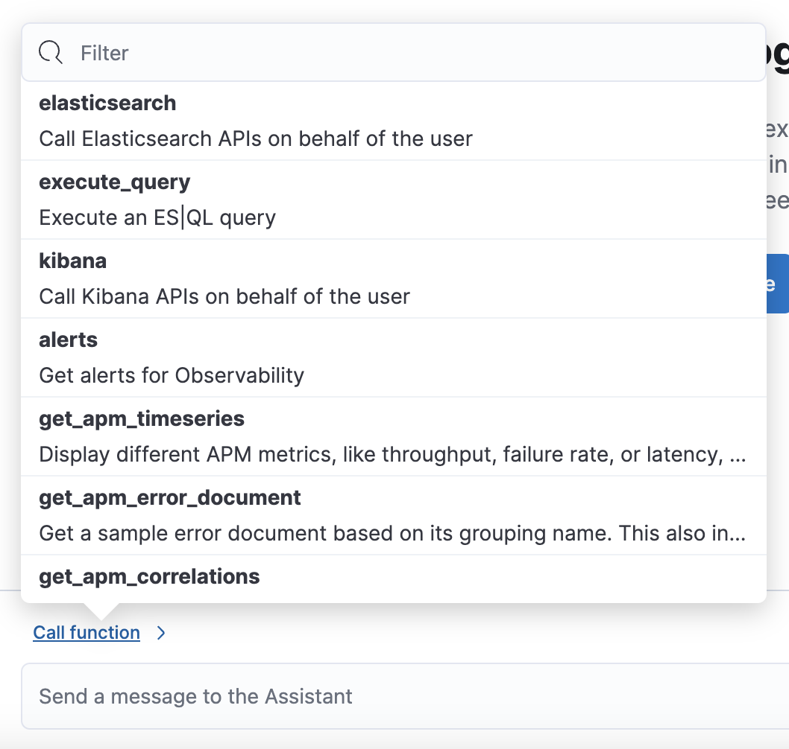

<p><DocBadge template="technical preview" /></p>

The AI Assistant uses generative AI, powered by a [connector](((kibana-ref))/openai-action-type.html) for OpenAI or Azure OpenAI Service, to provide:

* **Chat**: Have conversations with the AI Assistant. Chat uses function calling to request, analyze, and visualize your data.
* **Contextual insights**: Open prompts throughout ((observability)) that explain errors and messages and suggest remediation.


<DocCallOut title="Important" color="warning">

The Observability AI Assistant is in technical preview, and its capabilities are still developing. Users should leverage it sensibly as the reliability of its responses might vary. Always cross-verify any returned advice for accurate threat detection and response, insights, and query generation.

Also, the data you provide to the Observability AI assistant is _not_ anonymized, and is processed and might be stored by the third-party AI provider. This includes any data used in conversations for analysis or context, such as alert or event data, detection rule configurations, and queries. Therefore, be careful about sharing any confidential or sensitive details while using this feature.

</DocCallOut>

## Requirements

The AI assistant requires the following:

* An account with a third-party generative AI provider that supports function calling. The Observability AI Assistant supports the following providers:
    * OpenAI `gpt-4`+.
    * Azure OpenAI Service `gpt-4`(0613) or `gpt-4-32k`(0613) with API version `2023-07-01-preview` or more recent.
* The knowledge base requires a 4 GB ((ml)) node.

## Your data and the AI Assistant

Elastic does not store or examine prompts or results used by the AI Assistant, or use this data for model training. This includes anything you send the model, such as alert or event data, detection rule configurations, queries, and prompts. However, any data you provide to the AI Assistant will be processed by the third-party provider you chose when setting up the OpenAI connector as part of the assistant setup.

Elastic does not control third-party tools, and assumes no responsibility or liability for their content, operation, or use, nor for any loss or damage that may arise from your using such tools. Please exercise caution when using AI tools with personal, sensitive, or confidential information. Any data you submit may be used by the provider for AI training or other purposes. There is no guarantee that the provider will keep any information you provide secure or confidential. You should familiarize yourself with the privacy practices and terms of use of any generative AI tools prior to use.

## Set up the AI Assistant

To set up the AI Assistant:

1. Create an API key from your AI provider to authenticate requests from the AI Assistant. You'll use this in the next step. Refer to your provider's documentation for information on generating API keys:
    * [OpenAI](https://platform.openai.com/docs/api-reference)
    * [Azure OpenAI Service](https://learn.microsoft.com/en-us/azure/cognitive-services/openai/reference)
1. From **Project settings** → **Management** → **Connectors**, create a [OpenAI connector](((kibana-ref))/openai-action-type.html).
1. Authenticate communication between ((observability)) and the AI provider by providing the following information:
    1. Enter the AI provider's API endpoint URL in the **URL** field.
    1. Enter the API key you created in the previous step in the **API Key** field.

## Add data to the AI Assistant knowledge base

The AI Assistant uses [ELSER](((ml-docs))/ml-nlp-elser.html), Elastic's semantic search engine, to recall data from its internal knowledge base index to create retrieval augmented generation (RAG) responses. Adding data such as Runbooks, GitHub issues, internal documentation, and Slack messages to the knowledge base gives the AI Assistant context to provide more specific assistance.

<DocCallOut title="Note">
Your AI provider may collect telemetry when using the AI Assistant. Contact your AI provider for information on how data is collected.
</DocCallOut>

You can add information to the knowledge base by asking the AI Assistant to remember something while chatting (for example, "remember this for next time"). The assistant will create a summary of the information and add it to the knowledge base.

You can also add external data to the knowledge base by completing the following steps:

1. Ingest external data (GitHub issues, Markdown files, Jira tickets, text files, etc.) into ((es)) using the ((es)) [Index API](((ref))/docs-index_.html).
1. Reindex your data into the AI Assistant's knowledge base index by completing the following query in **Developer Tools** → **Console**. Update the following fields before reindexing:
    * `InternalDocsIndex`: Name of the index where your internal documents are stored.
    * `text_field`: Name of the field containing your internal documents' text.
    * `timestamp`: Name of the timestamp field in your internal documents.
    * `public`: If `true`, the document is available to all users with access to your Observability project. If `false`, the document is restricted to the user indicated in the following `user.name` field.
    * `user.name` (optional): If defined, restricts the internal document's availability to a specific user.
    * You can add a query filter to index specific documents.

```console
POST _reindex
{
    "source": {
        "index": "<InternalDocsIndex>",
        "_source": [
            "<text_field>",
            "<timestamp>",
            "namespace",
            "is_correction",
            "public",
            "confidence"
        ]
    },
    "dest": {
        "index": ".kibana-observability-ai-assistant-kb-000001",
        "pipeline": ".kibana-observability-ai-assistant-kb-ingest-pipeline"
    },
    "script": {
        "inline": "ctx._source.text = ctx._source.remove(\"<text_field>\");ctx._source.namespace=\"<space>\";ctx._source.is_correction=false;ctx._source.public=<public>;ctx._source.confidence=\"high\";ctx._source['@timestamp'] = ctx._source.remove(\"<timestamp>\");ctx._source['user.name'] = \"<user.name>\""
    }
}
```

## Interact with the AI Assistant

You can chat with the AI Assistant or interact with contextual prompts located throughout ((observability)). See the following sections for more on interacting with the AI Assistant.

### AI Assistant chat

Click **AI Assistant** in the upper-right corner where available to start the chat:


This opens the AI Assistant flyout, where you can ask the assistant questions about your instance:


The AI Assistant uses several functions to include relevant context in the chat conversation through text, data, and visual components. Both you and the AI Assistant can suggest functions. You can also edit the AI Assistant's function suggestions and inspect function responses. For example, you could use the `kibana` function to call a ((kib)) API on your behalf.

For a list of available functions, click **Call function <DocIcon type="arrowRight" title="Right-facing arrow icon" />**.



### AI Assistant contextual prompts

AI Assistant contextual prompts throughout ((observability)) provide the following information:

- **Alerts**: Provides possible causes and remediation suggestions for log rate changes.
- **Application performance monitoring (APM)**: Explains APM errors and provides remediation suggestions.
- **Logs**: Explains log messages and generates search patterns to find similar issues.

{/* Not included in initial serverless launch */}
{/* - **Universal Profiling**: explains the most expensive libraries and functions in your fleet and provides optimization suggestions. */}
{/* - **Infrastructure Observability**: explains the processes running on a host. */}

For example, in the log details, you'll see prompts for **What's this message?** and **How do I find similar log messages?**:


Clicking a prompt generates a message specific to that log entry.
You can continue a conversation from a contextual prompt by clicking **Start chat** to open the AI Assistant chat.


