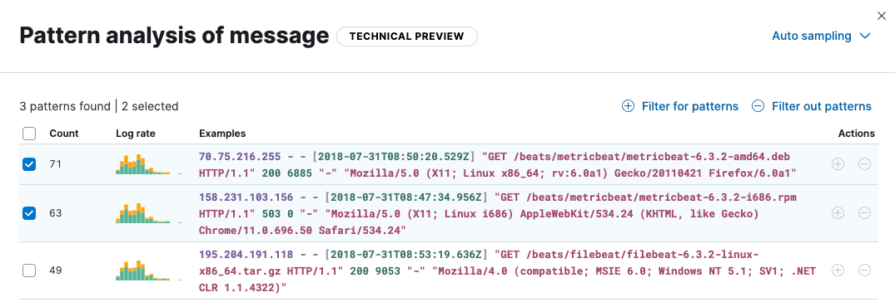

import InReview from '../partials/in-review-notice.mdx'

import Feedback from '../partials/feedback/widget.mdx'

<InReview />

<DocCallOut template="technical_preview" />

Elastic ((observability)) provides built-in log rate analysis capabilities,
based on advanced statistical methods,
to help you find and investigate the causes of unusual spikes or drops in log rates.

To analyze log spikes and drops:

1. From the main menu in Elastic ((observability)), select **AIOps -> Log rate analysis**.
1. Choose a data view or saved search to access the log data you want to analyze.
1. In the histogram chart, click a spike (or drop) to start the analysis.

    

    When the analysis runs, it identifies statistically significant field-value combinations that contribute to the spike or drop,
    and then displays them in a table:

    

    Notice that you can optionally turn on **Smart grouping** to summarize the results into groups.
    You can also click **Filter fields** to remove fields that are not relevant.

    The table shows an indicator of the level of impact and a sparkline showing the shape of the impact in the chart.
1. Select a row to display the impact of the field on the histogram chart.
1. From the **Actions** menu in the table, you can choose to view the field in **Discover**,
view it in <DocLink id="serverlessObservabilityAiopsAnalyzeSpikes" section="log-pattern-analysis" text="Log Pattern Analysis" />,
or copy the table row information to the clipboard as a query filter.

To pin a table row, click the row, then move the cursor to the histogram chart.
It displays a tooltip with exact count values for the pinned field which enables closer investigation.

Brushes in the chart show the baseline time range and the deviation in the analyzed data.
You can move the brushes to redefine both the baseline and the deviation and rerun the analysis with the modified values.

## Log pattern analysis

<DocCallOut template="technical_preview" />

Use log pattern analysis to find patterns in unstructured log messages and examine your data.
When you run a log pattern analysis, it performs categorization analysis on a selected field, creates categories based on the data, and then displays them together in a chart.
The chart shows the distribution of each category and an example document that matches the category.

To run log pattern analysis:

1. Follow the steps under <DocLink id="serverlessObservabilityAiopsAnalyzeSpikes"/> to run a log rate analysis.
1. From the **Actions** menu, choose **View in Log Pattern Analysis**.
1. Select a category field and optionally apply any filters that you want.
1. Click **Run pattern analysis**.

    The results of the analysis are shown in a table:

    

1. From the **Actions** menu, click the plus (or minus) icon to open **Discover** and show (or filter out) the given category there, which helps you to further examine your log messages.

{/* TODO: Question: Is the log pattern analysis only available through the log rate analysis UI? */}

{/* TODO: Add some good examples to this topic taken from existing docs or recommendations from reviewers. */}

<Feedback slug="/serverless/observability/aiops-analyze-spikes" filepath="docs/aiops/aiops-analyze-spikes.mdx" />
