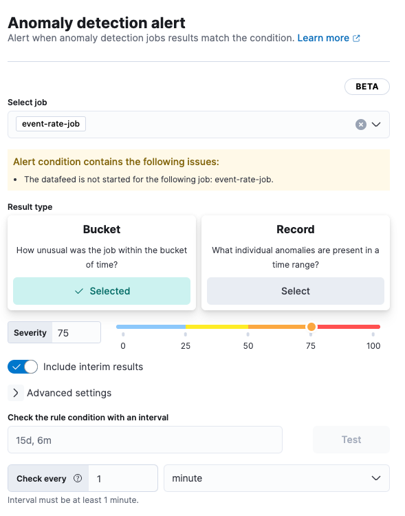

<DocBadge template="technical preview" />

import FeatureBeta from '../partials/feature-beta.mdx'

{/* TODO: Make the anomaly detection alert topics across obs consistent. */}

<FeatureBeta feature="Anomaly detection alerting" />

The alerting feature in Elastic ((observability)) enables you to set up rules that check for anomalies in one or more anomaly detection jobs.
If the conditions of the rule are met, an alert is created, and any actions specified in the rule are triggered.
For example, you can create a rule to check every fifteen minutes for critical anomalies and then alert you by email when they are detected.

The alerting feature supports a wide range of actions that enable you to send alerts to:

* Email
* Jira
* Slack
* ServiceNow
* PagerDuty
* Many other third-party tools and systems

# Create an anomaly detection rule

1. From the main menu in Elastic ((observability)), select **AIOps -> Anomaly detection**.
1. In the list of anomaly detection jobs, find the job you want to check for anomalies.
Haven't created a job yet? <DocLink id="serverlessObservabilityAiopsDetectAnomalies" text="Create one now" />.
1. From the **Actions** menu next to the job, select **Create alert rule**.
1. Specify a name and optional tags for the rule. You can use these tags later to filter alerts.
1. Verify that the correct job is selected and configure the alert details:

    

1. For the result type:

    <DocTable columns={[{ title:  "Choose...", width: "25%" }, { title:  "To generate an alert based on...", width: "75%"  }]}>
        <DocRow>
            <DocCell>**Bucket**</DocCell>
            <DocCell>How unusual the anomaly was within the bucket of time</DocCell>
        </DocRow>
        <DocRow>
            <DocCell>**Record**</DocCell>
            <DocCell>What individual anomalies are present in a time range</DocCell>
        </DocRow>
        <DocRow>
            <DocCell>**Influencer**</DocCell>
            <DocCell>The most unusual entities in a time range</DocCell>
        </DocRow>
    </DocTable>

1. Adjust the **Severity** to match the anomaly score that will trigger the action.
The anomaly score indicates the significance of a given anomaly compared to previous anomalies.
The default severity threshold is 75, which means every anomaly with an anomaly score of 75 or higher will trigger the associated action.

1. (Optional) Turn on **Include interim results** to include results that are created by the anomaly detection job _before_ a bucket is finalized. These results might disappear after the bucket is fully processed.
Include interim results if you want to be notified earlier about a potential anomaly even if it might be a false positive.

1. (Optional) Expand and change **Advanced settings**:

    <DocTable columns={[{ title: "Setting", width: "25%" }, { title: "Description", width: "75%" }]}>
        <DocRow>
            <DocCell>**Lookback interval**</DocCell>
            <DocCell>The interval used to query previous anomalies during each condition check. Setting the lookback interval lower than the default value might result in missed anomalies.</DocCell>
        </DocRow>
        <DocRow>
            <DocCell>**Number of latest buckets**</DocCell>
            <DocCell>The number of buckets to check to obtain the highest anomaly from all the anomalies that are found during the Lookback interval. An alert is created based on the anomaly with the highest anomaly score from the most anomalous bucket.</DocCell>
        </DocRow>
    </DocTable>
1. (Optional) Under **Check the rule condition with an interval**, specify an interval, then click **Test** to check the rule condition with the interval specified.
The button is grayed out if the datafeed is not started.
To test the rule, start the data feed.
1. (Optional) If you want to change how often the condition is evaluated, adjust the **Change every** setting.
1. (Optional) If you want the alert to trigger an action, define actions.

## Define actions

Add one or more actions to your rule to generate notifications when the rule's conditions are met and when they are no longer met.

Each action uses a connector.
The connector stores connection information for the service or supported third-party integration where you want to send the notifications.
For example, you can use a Slack connector to send a message to a channel.
Or you can use an index connector that writes an JSON object to a specific index.

You must set the action frequency, which involves choosing how often to run the action (for example, at each check interval, only when the alert status changes, or at a custom action interval). Each rule type also has a list of valid action groups and you must choose one of these groups (for example, the action runs when the issue is detected or when it is recovered).

1. In the **Actions** section of the **Create rule** flyout, select a connector type.
1. Select an existing connector, or click **Create a connector** to create a new one and configure the connector.
Each connector has different settings.
For details about configuring a specific type of connector, refer to the [Connectors documentation](((kibana-ref))/action-types.html).
Note that the connectors documentation may contain details that are not valid when using a fully-managed Elastic project.
1. In the  **Action frequency** list, choose how often the action runs (on status changes, on check intervals, or on custom action intervals).
1. In the **Run when** list, choose when you want the action to run (for example, when the anomaly score matched the condition or was recovered).
1. (Optional) Customize the notification messages for each action by using action variables in the message.
For a list of available action variables, refer to [Action variables](((ml-docs))/ml-configuring-alerts.html#action-variables.html).
Note that the actions documentation may contain details that are not valid when using a fully-managed Elastic project.
1. Save the rule.

## Edit an anomaly detection rule

To edit an anomaly detection rule:

1. From the main menu in Elastic ((observability)), select **AIOps -> Anomaly detection**.
1. Expand the job that uses the rule you want to edit.
1. On the **Job settings** tab, under **Alert rules**, click the rule to edit it.
