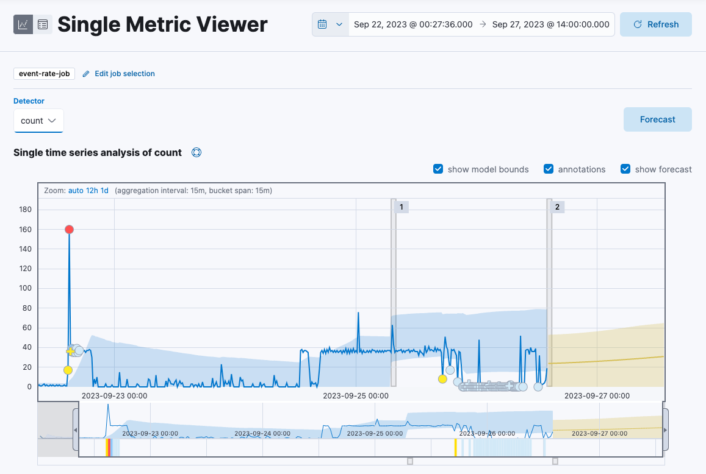

<DocBadge template="technical preview" />
In addition to detecting anomalous behavior in your data,
you can use the ((ml)) features to predict future behavior.

You can use a forecast to estimate a time series value at a specific future date.
For example, you might want to determine how much disk usage to expect
next Sunday at 09:00.

You can also use a forecast to estimate the probability of a time series value occurring at a future date.
For example, you might want to determine how likely it is that your disk utilization will reach 100% before the end of next week.

To create a forecast:

1. <DocLink id="serverlessObservabilityAiopsDetectAnomalies" text="Create an anomaly detection job" /> and view the results in the **Single Metric Viewer**.
1. Click **Forecast**.
1. Specify a duration for your forecast.
This value indicates how far to extrapolate beyond the last record that was processed.
You must use time units, for example 1w, 1d, 1h, and so on.
1. Click **Run**.
1. View the forecast in the **Single Metric Viewer**:

    

    {/* TODO: Placeholder image ^^; replace with image showing better data if necessary.
    The forecast in the current screenshot does not seem very...robust.  */}

    * The line in the chart represents the predicted data values.
    * The shaded area represents the bounds for the predicted values, which also gives an indication of the confidence of the predictions.
    * Note that the bounds generally increase with time (that is to say, the confidence levels decrease),
    since you are forecasting further into the future.
    Eventually if the confidence levels are too low, the forecast stops.

1. (Optional) After the job has processed more data, click the **Forecast** button again to compare the forecast to actual data.

        The resulting chart will contain the actual data values, the bounds for the expected values, the anomalies, the forecast data values, and the bounds for the forecast.
        This combination of actual and forecast data gives you an indication of how well the ((ml)) features can extrapolate the future behavior of the data.
