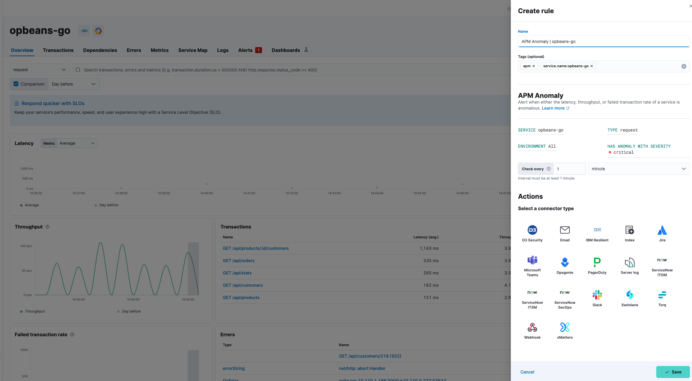

<DocBadge template="technical preview" />

import Roles from '../partials/roles.mdx'

<Roles role="Editor" goal="create anomaly rules" />

import Actions from '../transclusion/actions.mdx'

You can create an anomaly rule to alert you when either the latency, throughput, or failed transaction rate of a service is abnormal. Anomaly rules can be set at different levels: environment, service, and/or transaction type. Add actions to raise alerts via services or third-party integrations (for example, send an email or create a Jira issue).

To create your anomaly rule:

1. Select **Manage Rules** from the **Alerts** page, and select **Create rule**.
1. Enter a **Name** for your rule, and any optional **Tags** for more granular reporting (leave blank if unsure).
1. Select the **Anomaly** rule type from the APM use case.
1. Select the appropriate **Service**, **Type**, and **Environment** (or leave **ALL** to include all options).
1. Select the desired severity (critical, major, minor, warning) from **Has anomaly with severity**.
1. Define the interval to check the rule (for example, check every 1 minute).
1. (Optional) Set up **Actions**.
1. **Save** your rule.

<DocCallOut title="Tip">
You can also create an anomaly rule directly from any page within **Applications**. Click the **Alerts and rules** button, and select **Create anomaly rule**. When you create a rule this way, the **Name** and **Tags** fields will be prepopulated but you can still change these.
</DocCallOut>

<Actions />

