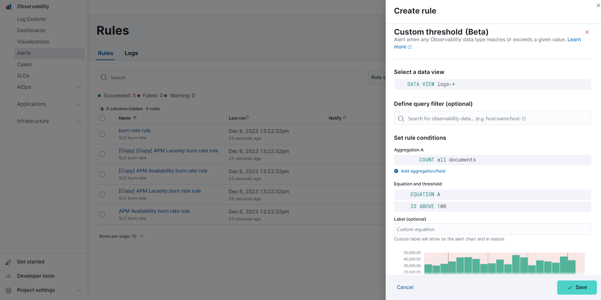

<DocBadge template="technical preview" />
 

import Actions from '../transclusion/actions.mdx'
import FeatureBeta from '../partials/feature-beta.mdx'

<FeatureBeta feature="Custom threshold rule" />

Create a custom threshold rule to trigger an alert when an ((observability)) data type reaches or exceeds a given value.

1. To access this page, from your project go to **Alerts**.
1. Click **Manage Rules** -> **Create rule**.
1. Under **Select rule type**, select **Custom threshold**.

## Define rule data

Specify the following settings to define the data the rule applies to:

* **Select a data view:** Click the data view field to search for and select a data view that points to the indices or data streams that you're creating a rule for. You can also create a _new_ data view by clicking **Create a data view**. Refer to [Create a data view](((kibana-ref))/data-views.html) for more on creating data views.
* **Define query filter (optional):** Use a query filter to narrow down the data that the rule applies to. For example, set a query filter to a specific host name using the query filter `host.name:host-1` to only apply the rule to that host.

## Set rule conditions

Set the conditions for the rule to detect using aggregations, an equation, and a threshold.

### Set aggregations

Aggregations summarize your data to make it easier to analyze.
Set any of the following aggregation types to gather data to create your rule:

* **Average:** The average value of a numeric field.
* **Max:** The highest value of a numeric field.
* **Min:** The lowest value of a numeric field.
* **Cardinality:** The approximate number of unique values in a field.
* **Count:** The total number of documents in a field.
* **Sum:** The total of a numeric field in your dataset.

For example, to gather the total number of log documents with a log level of `warn`:

1. Set the **Aggregation** to **Count**, and set the **KQL Filter** to `log.level: "warn"`.
1. Set the threshold to `IS ABOVE 100` to trigger an alert when the number of log documents with a log level of `warn` reaches 100.

### Set the equation and threshold

Set an equation using your aggregations. Based on the results of your equation, set a threshold to define when to trigger an alert. The equations use basic math or boolean logic. Refer to the following examples for possible use cases.

### Basic math equation

Add, subtract, multiply, or divide your aggregations to define conditions for alerting.

**Example:**
Set an equation and threshold to trigger an alert when a metric is above a threshold. For this example, we'll use average CPU usage—the percentage of CPU time spent in states other than `idle` or `IOWait` normalized by the number of CPU cores—and trigger an alert when CPU usage is above a specific percentage. To do this, set the following aggregations, equation, and threshold:

1. Set the following aggregations:
    * **Aggregation A:** Average `system.cpu.user.pct`
    * **Aggregation B:** Average `system.cpu.system.pct`
    * **Aggregation C:** Max `system.cpu.cores`.
1. Set the equation to `(A + B) / C * 100`
1. Set the threshold to `IS ABOVE 95` to alert when CPU usage is above 95%.

### Boolean logic

Use conditional operators and comparison operators with you aggregations to define conditions for alerting.

**Example:**
Set an equation and threshold to trigger an alert when the number of stateful pods differs from the number of desired pods. For this example, we'll use `kubernetes.statefulset.ready` and `kubernetes.statefulset.desired`, and trigger an alert when their values differ. To do this, set the following aggregations, equation, and threshold:

1. Set the following aggregations:
    * **Aggregation A:** Sum `kubernetes.statefulset.ready`
    * **Aggregation B:** Sum `kubernetes.statefulset.desired`
1. Set the equation to `A == B ? 1 : 0`. If A and B are equal, the result is `1`. If they're not equal, the result is `0`.
1. Set the threshold to `IS BELOW 1` to trigger an alert when the result is `0` and the field values do not match.

## Preview chart

The preview chart provides a visualization of how many entries match your configuration.
The shaded area shows the threshold you've set.

## Group alerts by (optional)

Set one or more **group alerts by** fields for custom threshold rules to perform a composite aggregation against the selected fields.
When any of these groups match the selected rule conditions, an alert is triggered _per group_.

When you select multiple groupings, the group name is separated by commas.

For example, if you group alerts by the `host.name` and `host.architecture` fields, and there are two hosts (`Host A` and `Host B`) and two architectures (`Architecture A` and `Architecture B`), the composite aggregation forms multiple groups.

If the `Host A, Architecture A` group matches the rule conditions, but the `Host B, Architecture B` group doesn't, one alert is triggered for `Host A, Architecture A`.

If you select one field—for example, `host.name`—and `Host A` matches the conditions but `Host B` doesn't, one alert is triggered for `Host A`.
If both groups match the conditions, alerts are triggered for both groups.

When you select **Alert me if a group stops reporting data**, the rule is triggered if a group that previously reported metrics does not report them again over the expected time period.

<Actions />
