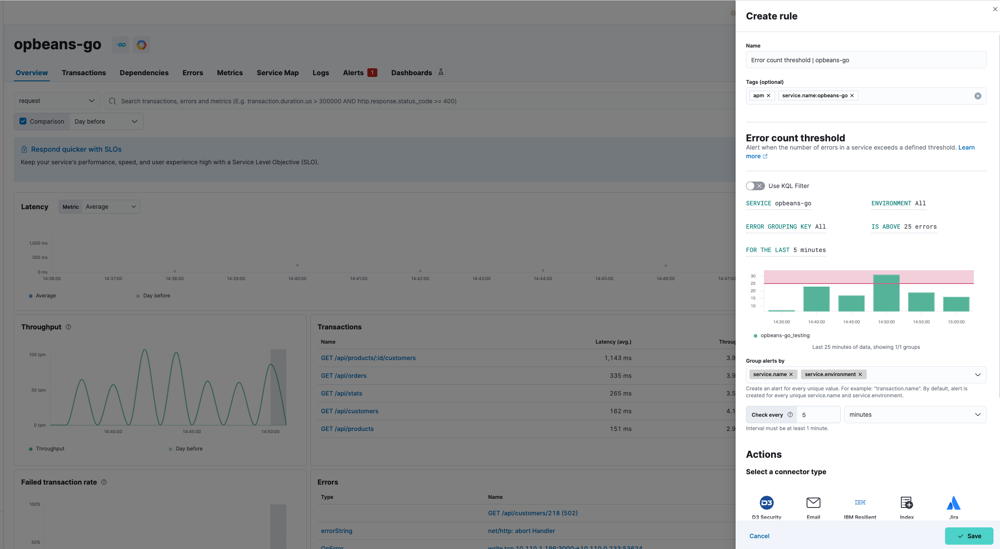

import Feedback from '../partials/feedback/widget.mdx'
import Actions from '../transclusion/actions.mdx'
import Testing from '../partials/in-testing-notice.mdx'

<Testing />

Create an error count threshold rule to alert you when the number of in a service exceeds a defined threshold. Threshold rules can be set at different levels: environment, service, transaction type, and/or transaction name.   

To create your error count threshold rule:

1. Select **Manage Rules** from the **Alerts** page, and select **Create rule**.
1. Enter a **Name** for your rule, and any optional **Tags** for more granular reporting (leave blank if unsure).
1. Select the **Error count threshold** rule type from the APM use case.
1. Select the appropriate **Service**, **Environment**, and **Error Grouping Key** (or leave **ALL** to include all options). Alternatively, you can select **Use KQL Filter** and enter a KQL expression to limit the scope of your rule.
1. Enter the error threshold in **Is Above** (defaults to 25 errors).
1. Define the period to be assessed in **For the last** (defaults to last 5 minutes).
1. Choose how to **Group alerts by** - every unique value will create an alert.
1. Define the interval to check the rule (for example, check every 1 minute).
1. (Optional) Set up **Actions**.
1. **Save** your rule.

<DocCallOut title="Tip">
You can also create an error count threshold rule directly from any page within **Applications**. Click the **Alerts and rules** button, and select **Create error count rule**. When you create a rule this way, the **Name** and **Tags** fields will be pre-populated but you can still change these. 
</DocCallOut>

{/* Placeholder link for connectors for now  */}

<Actions />

## Example

The error count threshold alert triggers when the number of errors in a service exceeds a defined threshold. Because some errors are more important than others, this guide will focus a specific error group ID.

Before continuing, identify the service name, environment name, and error group ID that you’d like to create an error count threshold rule for. 
{/* The easiest way to find an error group ID is to select the service that you’re interested in and navigating to the Errors tab. // is there a Serverless equivalent? */}

This guide will create an alert for an error group ID based on the following criteria:

* Service: `{your_service.name}`
* Environment: `{your_service.environment}`
* Error Grouping Key: `{your_error.ID}`
* Error count is above 25 errors for the last five minutes
* Group alerts by `service.name` and `service.environment`
* Check every 1 minute
* Send the alert via email to the site reliability team

From any page in **Applications**, select **Alerts and rules** -> **Create threshold rule** -> **Error count rule**. Change the name of the alert (if you wish), but do not edit the tags.

Based on the criteria above, define the following rule details:

* **Service**: `{your_service.name}`
* **Environment**: `{your_service.environment}`
* **Error Grouping Key**: `{your_error.ID}`
* **Is above** - `25 errors`
* **For the last** - `5 minutes`
* **Group alerts by** - `service.name` `service.environment`
* **Check every** - `1 minute`

Next, select the **Email** connector and click **Create a connector**. Fill out the required details: sender, host, port, etc., and select **Save**.

A default message is provided as a starting point for your alert. You can use the Mustache template syntax (`{{variable}}`) to pass additional alert values at the time a condition is detected to an action. A list of available variables can be accessed by clicking the Add variable icon <DocIcon type="indexOpen" title="Add variable" />.

Select **Save**. The alert has been created and is now active!

<Feedback slug="/serverless/observability/create-error-count-threshold-alert-rule" filepath="docs/alerting/create-error-count-threshold-alert-rule.mdx" />