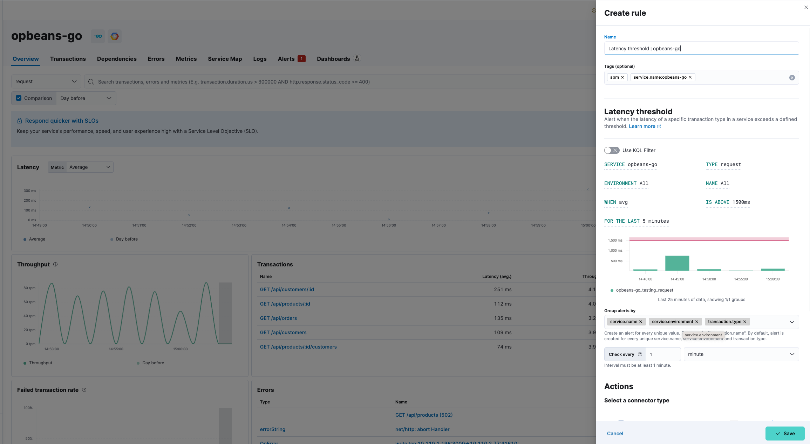

import Feedback from '../partials/feedback/widget.mdx'

import Testing from '../partials/in-testing-notice.mdx'

<Testing />

You can create a latency threshold rule to alert you when the latency of a specific transaction type in a service exceeds a defined threshold. Threshold rules can be set at different levels: environment, service, transaction type, and/or transaction name. Add actions to raise alerts via services or third-party integrations e.g. mail, Slack, Jira.  

To create your latency threshold rule::

1. Select **Manage Rules** from the **Alerts** page, and select **Create rule**.
1. Enter a **Name** for your rule, and any optional **Tags** for more granular reporting (leave blank if unsure).
1. Select the **Latency threshold** rule type from the APM use case.
1. Select the appropriate **Service**, **Type**, **Environment** and **Name** (or leave **ALL** to include all options). Alternatively, you can select **Use KQL Filter** and enter a KQL expression to limit the scope of your rule.
1. Define the threshold and period:
    * **When**: Choose between `Average`, `95th percentile`, or `99th percentile`.
    * **Is Above**: Enter a time in milliseconds (defaults to 1500ms).
    * **For the last**: Define the period to be assessed in (defaults to last 5 minutes).
1. Choose how to **Group alerts by** - every unique value will create an alert.
1. Define the interval to check the rule e.g. check every 1 minute.
1. (Optional) Set up **Actions**.
1. **Save** your rule.

<DocCallOut title="Tip">
You can also create a latency threshold rule directly from any page within **Applications**. Click the **Alerts and rules** button, and select **Create threshold rule** and then **Latency**. When you create a rule this way, the **Name** and **Tags** fields will be pre-populated but you can still change these. 
</DocCallOut>

{/* Placeholder link for connectors for now  */}

## Actions

You can extend your rules by connecting them to **Actions** that use the following supported built-in integrations.

<DocAccordion buttonContent="Action types">
Actions are services or integrations with third-party systems that run as background tasks when rule conditions are met.

   
</DocAccordion>

<DocAccordion buttonContent="Action frequency">
After you select a connector, you must set the action frequency. You can choose to create a **Summary of alerts** on each check interval or on a custom interval. For example, you can send email notifications that summarize the new, ongoing, and recovered alerts every twelve hours.

Alternatively, you can set the action frequency to **For each alert** and specify the conditions each alert must meet for the action to run. For example, you can send an email only when the alert status changes to critical.

</DocAccordion>

<DocAccordion buttonContent="Action variables">
Use the default notification message or customize it.
You can add more context to the message by clicking the icon above the message text box
and selecting from a list of available variables.

</DocAccordion>

<DocCallOut title="Note">
You can add an action to a rule at any time. You can create rules without adding actions, and you can also define multiple actions for a single rule. To add actions to rules, you must first create a connector for that service (e.g. email, external incident management system), which you can then use for different rules, each with their own action frequency. For more information on creating connectors, refer to <DocLink id="serverlessObservabilitySendCasesToAnExternalSystem">Send cases to an external system</DocLink>.
</DocCallOut>

## Example

The latency threshold threshold alert triggers when the latency of a specific transaction type in a service exceeds a defined threshold. 

Before continuing, identify the service name, environment name, and transaction type that you’d like to create a latency threshold rule for. 

This guide will create an alert for an error group ID based on the following criteria:

* Service: `{your_service.name}`
* Transaction: `{your_transaction.name}`
* Environment: `{your_service.environment}`
* Average latency is above 1500ms for last 5 minutes
* Group alerts by `service.name` and `service.environment`
* Check every 1 minute
* Send the alert via email to the site reliability team

From any page in **Applications**, select **Alerts and rules** -> **Create threshold rule** -> **Latency threshold**. Change the name of the alert (if you wish), but do not edit the tags.

Based on the criteria above, define the following rule details:

* **Service**: `{your_service.name}`
* **Type**: `{your_transaction.name}`
* **Environment**: `{your_service.environment}`
* **When** - `Average`
* **Is above** - `1500ms`
* **For the last** - `5 minutes`
* **Group alerts by** - `service.name` `service.environment`
* **Check every** - `1 minute`

Next, select the **Email** connector and click **Create a connector**. Fill out the required details: sender, host, port, etc., and select **Save**.

A default message is provided as a starting point for your alert. You can use the Mustache template syntax (i.e. `{{variable}}`) to pass additional alert values at the time a condition is detected to an action. A list of available variables can be accessed by selecting the add variable button.

Select **Save**. The alert has been created and is now active!

<Feedback slug="/serverless/observability/create-latency-threshold-alert-rule" filepath="docs/alerting/create-latency-threshold-alert-rule.mdx" />

