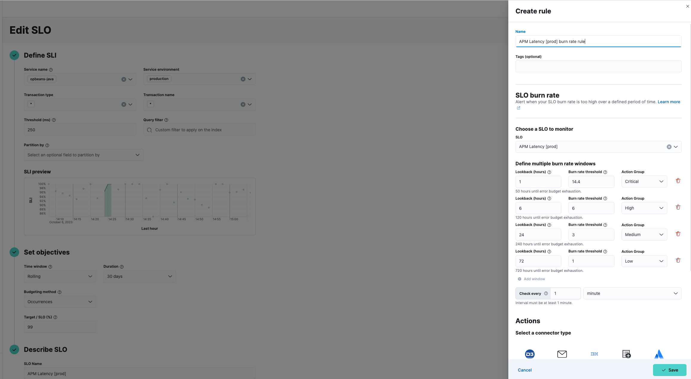

<DocBadge template="technical preview" />

import Connectors from './alerting-connectors.mdx'

import Roles from '../partials/roles.mdx'

<Roles role="Editor" goal="create rules for alerting" />

Create an SLO burn rate rule to get alerts when the burn rate is too high over a defined threshold for two different lookback periods: a long period and a short period that is 1/12th of the long period. For example, if your long lookback period is one hour, your short lookback period is five minutes.

Choose which SLO to monitor and then define multiple burn rate windows with appropriate severity. For each period, the burn rate is computed as the error rate divided by the error budget. When the burn rates for both periods surpass the threshold, an alert is triggered. Add actions to raise alerts via services or third-party integrations e.g. mail, Slack, Jira.

<DocCallOut title="Tip">
These steps show how to use the **Alerts** UI. You can also create an SLO burn rate rule directly from **Observability** → **SLOs**.
Click the more options icon (<DocIcon type="boxesVertical" title="More options" />) to the right of the SLO you want to add a burn rate rule for, and select **<DocIcon type="bell" title="Bell" /> Create new alert rule** from the menu.

When you use the UI to create an SLO, a default SLO burn rate alert rule is created automatically.
The burn rate rule will use the default configuration and no connector.
You must configure a connector if you want to receive alerts for SLO breaches.
</DocCallOut>

To create an SLO burn rate rule:

1. In your ((observability)) project, go to **Alerts**.
1. Select **Manage Rules** from the **Alerts** page, and select **Create rule**.
1. Enter a **Name** for your rule, and any optional **Tags** for more granular reporting (leave blank if unsure).
1. Select **SLO burn rate** from the **Select rule type** list.
1. Select the **SLO** you want to monitor.
1. Define multiple burn rate windows for each **Action Group** (defaults to 4 windows but you can edit):
    * **Lookback (hours)**: Enter the lookback period for this window. A shorter period equal to 1/12th of this period will be used for faster recovery.
    * **Burn rate threshold**: Enter a burn rate for this window.
    * **Action Group**: Select a severity for this window.
1. Define the interval to check the rule e.g. check every 1 minute.
1. (Optional) Set up **Actions**.
1. **Save** your rule.

## Add actions

You can extend your rules with actions that interact with third-party systems, write to logs or indices, or send user notifications. You can add an action to a rule at any time. You can create rules without adding actions, and you can also define multiple actions for a single rule.

To add actions to rules, you must first create a connector for that service (for example, an email or external incident management system), which you can then use for different rules, each with their own action frequency.

<DocAccordion buttonContent="Connector types">
Connectors provide a central place to store connection information for services and integrations with third party systems.
The following connectors are available when defining actions for alerting rules:

<Connectors />

For more information on creating connectors, refer to <DocLink id="serverlessActionConnectors">Connectors</DocLink>.

</DocAccordion>

<DocAccordion buttonContent="Action frequency">
After you select a connector, you must set the action frequency. You can choose to create a **Summary of alerts** on each check interval or on a custom interval. For example, you can send email notifications that summarize the new, ongoing, and recovered alerts every twelve hours.

Alternatively, you can set the action frequency to **For each alert** and specify the conditions each alert must meet for the action to run. For example, you can send an email only when the alert status changes to critical.

With the **Run when** menu you can choose if an action runs for a specific severity (critical, high, medium, low), or when the alert is recovered. For example, you can add a corresponding action for each severity you want an alert for, and also for when the alert recovers.

</DocAccordion>

<DocAccordion buttonContent="Action variables">
Use the default notification message or customize it.
You can add more context to the message by clicking the Add variable icon <DocIcon type="indexOpen" title="Add variable" /> and selecting from a list of available variables.

The following variables are specific to this rule type.
You can also specify [variables common to all rules](((kibana-ref))/rule-action-variables.html).

<DocDefList>
   <DocDefTerm>`context.alertDetailsUrl`</DocDefTerm>
    <DocDefDescription>
        Link to the alert troubleshooting view for further context and details. This will be an empty string if the `server.publicBaseUrl` is not configured.
    </DocDefDescription>
    <DocDefTerm>`context.burnRateThreshold`</DocDefTerm>
    <DocDefDescription>
        The burn rate threshold value.
    </DocDefDescription>
    <DocDefTerm>`context.longWindow`</DocDefTerm>
    <DocDefDescription>
        The window duration with the associated burn rate value.
    </DocDefDescription>
    <DocDefTerm>`context.reason`</DocDefTerm>
    <DocDefDescription>
        A concise description of the reason for the alert.
    </DocDefDescription>
    <DocDefTerm>`context.shortWindow`</DocDefTerm>
    <DocDefDescription>
        The window duration with the associated burn rate value.
    </DocDefDescription>
    <DocDefTerm>`context.sloId`</DocDefTerm>
    <DocDefDescription>
        The SLO unique identifier.
    </DocDefDescription>
    <DocDefTerm>`context.sloInstanceId`</DocDefTerm>
    <DocDefDescription>
        The SLO instance ID.
    </DocDefDescription>
    <DocDefTerm>`context.sloName`</DocDefTerm>
    <DocDefDescription>
        The SLO name.
    </DocDefDescription>
    <DocDefTerm>`context.timestamp`</DocDefTerm>
    <DocDefDescription>
        A timestamp of when the alert was detected.
    </DocDefDescription>
    <DocDefTerm>`context.viewInAppUrl`</DocDefTerm>
    <DocDefDescription>
        The url to the SLO details page to help with further investigation.
    </DocDefDescription>
</DocDefList>

</DocAccordion>