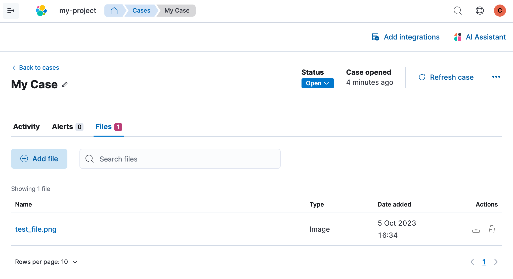

import Feedback from '../partials/feedback/widget.mdx'

import InReview from '../partials/in-review-notice.mdx'

<InReview />

Open a new case to keep track of issues and share the details with colleagues.
To create a case in your Observability project:

1. Go to **Cases** and click **Create case**.
1. Give the case a name, severity, and description.

    <DocCallOut title="Tip">
    In the `Description` area, you can use
    [Markdown](https://www.markdownguide.org/cheat-sheet) syntax to create formatted text.
    </DocCallOut>

1. (Optional) Add a category, assignees, and tags.
    {/* To do: Need to verify that a viewer cannot be assigned to a case
    (all I know is that they can _view_ the case) */}
    You can add users who are assigned the Editor user role (or a more permissive role) for the project.

1. (Optional) Under External incident management system, you can select a connector to send cases to an external system.
    If you've created any connectors previously, they will be listed here.
    If there are no connectors listed, you can <DocLink id="serverlessObservabilitySendCasesToAnExternalSystem">create one</DocLink>.

1. After you've completed all of the required fields, click **Create case**.

## Add files

After you create a case, you can upload and manage files on the **Files** tab:

{/* TODO: Find out if it's possible to configure mime types and max file sizes in serverless.
    If not, we should at least document what is supported.*/}
{/*The acceptable file types and sizes are affected by your [((kib)) case settings](((kibana-ref))/cases-settings.html). */}

When you upload a file, a comment is added to the case activity log.
To view an image, click its name in the activity or file list.

<DocCallOut title="Note">
Uploaded files are also accessible under **Project settings -> Management -> Files**.
When you export cases as [saved objects](((kibana-ref))/managing-saved-objects.html), the case files are not exported.
</DocCallOut>

## Add email notifications

{/* TODO: Testing still in progress for this... */}

You can configure email notifications that occur when users are assigned to
cases.
{/* To do this, add the email addresses to the monitoring email allowlist. */}
{/* Follow the steps in [Send alerts by email](((cloud))/ec-watcher.html#ec-watcher-allowlist). */}

You do not need to configure an email connector or update
user settings, since the preconfigured Elastic-Cloud-SMTP connector is
used by default.

When you subsequently add assignees to cases, they receive an email.

## Manage existing cases

You can search existing cases and filter them by attributes such as assignees,
categories, severity, status, and tags. You can also select multiple cases and use bulk
actions to delete cases or change their attributes.

To view a case, click on its name. You can then:

* Add a new comment.
* Edit existing comments and the description.
* Add or remove assignees.
* Add a <DocLink id="serverlessObservabilitySendCasesToAnExternalSystem">connector</DocLink> (if you did not select one while creating the case).
* Send updates to external systems (if external connections are configured).
* Edit the category and tags.
* Change the status.
* Change the severity.
* Remove an alert.
* Refresh the case to retrieve the latest updates.
* Close the case.
* Reopen a closed case.

<Feedback slug="/serverless/observability/create-a-new-case" filepath="docs/cases/create-a-new-case.mdx" />
