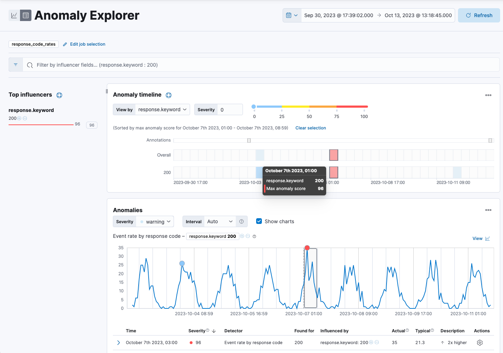

<DocBadge template="technical preview" />

import Roles from '../partials/roles.mdx'

<Roles role="Editor" goal="create, run, and view ((anomaly-job))s" />

The anomaly detection feature in Elastic ((observability)) automatically models the normal behavior of your time series data — learning trends,
periodicity, and more — in real time to identify anomalies, streamline root cause analysis, and reduce false positives.

To set up anomaly detection, you create and run anomaly detection jobs.
Anomaly detection jobs use proprietary ((ml)) algorithms to detect anomalous events or patterns, such as:

* Anomalies related to temporal deviations in values, counts, or frequencies
* Anomalies related to unusual locations in geographic data
* Statistical rarity
* Unusual behaviors for a member of a population

To learn more about anomaly detection algorithms, refer to the [((ml))](((ml-docs))/ml-ad-algorithms.html) documentation.
Note that the ((ml)) documentation may contain details that are not valid when using a serverless project.

<DocCallOut title="Some terms you might need to know">

A _datafeed_ retrieves time series data from ((es)) and provides it to an
anomaly detection job for analysis.

The job uses _buckets_ to divide the time series into batches for processing.
For example, a job may use a bucket span of 1 hour.

Each ((anomaly-job)) contains one or more _detectors_, which define the type of
analysis that occurs (for example, `max`, `average`, or `rare` analytical
functions) and the fields that are analyzed. Some of the analytical functions
look for single anomalous data points. For example, `max` identifies the maximum
value that is seen within a bucket. Others perform some aggregation over the
length of the bucket. For example, `mean` calculates the mean of all the data
points seen within the bucket.

To learn more about anomaly detection, refer to the [((ml))](((ml-docs))/ml-ad-overview.html) documentation.

</DocCallOut>

# Create and run an anomaly detection job

1. In your ((observability)) project, go to **AIOps** → **Anomaly detection**.
1. Click **Create anomaly detection job** (or **Create job** if other jobs exist).
1. Choose a data view or saved search to access the data you want to analyze.
1. Select the wizard for the type of job you want to create.
The following wizards are available.
You might also see specialized wizards based on the type of data you are analyzing.
<DocCallOut title="Tip">
In general, it is a good idea to start with single metric anomaly detection jobs for your key performance indicators.
After you examine these simple analysis results, you will have a better idea of what the influencers might be.
Then you can create multi-metric jobs and split the data or create more complex analysis functions as necessary.

    </DocCallOut>
        <DocDefList>
            <DocDefTerm>Single metric</DocDefTerm>
            <DocDefDescription>
                Creates simple jobs that have a single detector. A _detector_ applies an analytical function to specific fields in your data. In addition to limiting the number of detectors, the single metric wizard omits many of the more advanced configuration options.
            </DocDefDescription>
            <DocDefTerm>Multi-metric</DocDefTerm>
            <DocDefDescription>
                Creates jobs that can have more than one detector, which is more efficient than running multiple jobs against the same data.
            </DocDefDescription>
            <DocDefTerm>Population</DocDefTerm>
            <DocDefDescription>
                Creates jobs that detect activity that is unusual compared to the behavior of the population.
            </DocDefDescription>
            <DocDefTerm>Advanced</DocDefTerm>
            <DocDefDescription>
                Creates jobs that can have multiple detectors and enables you to configure all job settings.
            </DocDefDescription>
            <DocDefTerm>Categorization</DocDefTerm>
            <DocDefDescription>
                Creates jobs that group log messages into categories and use `count` or `rare` functions to detect anomalies within them.
            </DocDefDescription>
            <DocDefTerm>Rare</DocDefTerm>
            <DocDefDescription>
                Creates jobs that detect rare occurrences in time series data. Rare jobs use the `rare` or `freq_rare` functions and also detect rare occurrences in populations.
            </DocDefDescription>
            <DocDefTerm>Geo</DocDefTerm>
            <DocDefDescription>
                Creates jobs that detect unusual occurrences in the geographic locations of your data. Your data set must contain geo data.
            </DocDefDescription>
        </DocDefList>

    For more information about job types, refer to the [((ml))](((ml-docs))/ml-anomaly-detection-job-types.html) documentation.

    <DocCallOut title="Not sure what type of job to create?">

        Before selecting a wizard, click **Data Visualizer** to explore the fields and metrics in your data.
        To get the best results, you must understand your data, including its data types and the range and distribution of values.

        In the **Data Visualizer**, use the time filter to select a time period that you’re interested in exploring,
        or click **Use full data** to view the full time range of data.
        Expand the fields to see details about the range and distribution of values.
        When you're done, go back to the first step and create your job.
    </DocCallOut>
5. Step through the instructions in the job creation wizard to configure your job.
You can accept the default settings for most settings now and <DocLink slug="/serverless/observability/aiops-tune-anomaly-detection-job" text="tune the job" /> later.
1. If you want the job to start immediately when the job is created, make sure that option is selected on the summary page.
1. When you're done, click **Create job**.
When the job runs, the ((ml)) features analyze the input stream of data, model its behavior, and perform analysis based on the detectors in each job.
When an event occurs outside of the baselines of normal behavior, that event is identified as an anomaly.
1. After the job is started, click **View results**.

# View the results

After the anomaly detection job has processed some data,
you can view the results in Elastic ((observability)).

<DocCallOut title="Tip">
Depending on the capacity of your machine,
you might need to wait a few seconds for the analysis to generate initial results.
</DocCallOut>

If you clicked **View results** after creating the job, the results open in either the **Single Metric Viewer** or **Anomaly Explorer**.
To switch between these tools, click the icons in the upper-left corner of each tool.

Read the following sections to learn more about these tools:

* <DocLink slug="/serverless/observability/aiops-detect-anomalies" section="view-single-metric" text="View single metric job results" />
* <DocLink slug="/serverless/observability/aiops-detect-anomalies" section="anomaly-explorer" text="View advanced or multi-metric job results" />

## View single metric job results

The **Single Metric Viewer** contains a chart that represents the actual and expected values over time:

* The line in the chart represents the actual data values.
* The shaded area represents the bounds for the expected values.
* The area between the upper and lower bounds are the most likely values for the model, using a 95% confidence level.
That is to say, there is a 95% chance of the actual value falling within these bounds.
If a value is outside of this area then it will usually be identified as anomalous.

<DocCallOut title="Tip">
    Expected values are available only if **Enable model plot** was selected under Job Details
    when you created the job.
</DocCallOut>

To explore your data:

1. If the **Single Metric Explorer** is not already open, go to **AIOps** → **Anomaly detection** and click the Single Metric Explorer icon next to the job you created.
Note that the Single Metric Explorer icon will be grayed out for advanced or multi-metric jobs.
1. In the time filter, specify a time range that covers the majority of the analyzed data points.
1. Notice that the model improves as it processes more data.
At the beginning, the expected range of values is pretty broad, and the model is not capturing the periodicity in the data.
But it quickly learns and begins to reflect the patterns in your data.
The duration of the learning process heavily depends on the characteristics and complexity of the input data.
1. Look for anomaly data points, depicted by colored dots or cross symbols, and hover over a data point to see more details about the anomaly.
Note that anomalies with medium or high multi-bucket impact are depicted with a cross symbol instead of a dot.
    <DocCallOut title="How are anomaly scores calculated?">
    Any data points outside the range that was predicted by the model are marked
    as anomalies. In order to provide a sensible view of the results, an
    _anomaly score_ is calculated for each bucket time interval. The anomaly score
    is a value from 0 to 100, which indicates the significance of the anomaly
    compared to previously seen anomalies. The highly anomalous values are shown in
    red and the low scored values are shown in blue. An interval with a high
    anomaly score is significant and requires investigation.
    For more information about anomaly scores, refer to the [((ml))](((ml-docs))/ml-ad-explain.html) documentation.
    </DocCallOut>
1. (Optional) Annotate your job results by drag-selecting a period of time and entering annotation text.
Annotations are notes that refer to events in a specific time period.
They can be created by the user or generated automatically by the anomaly detection job to reflect model changes and noteworthy occurrences.
1. Under **Anomalies**, expand each anomaly to see key details, such as the time, the actual and expected ("typical") values, and their probability.
The **Anomaly explanation** section gives you further insights about each anomaly, such as its type and impact, to make it easier to interpret the job results:

    

    By default, the **Anomalies** table contains all anomalies that have a severity of "warning" or higher in the selected section of the timeline.
    If you are only interested in critical anomalies, for example, you can change the severity threshold for this table.

1. (Optional) From the **Actions** menu in the **Anomalies** table, you can choose to view relevant documents in **Discover** or create a job rule.
Job rules instruct anomaly detectors to change their behavior based on domain-specific knowledge that you provide.
To learn more, refer to <DocLink slug="/serverless/observability/aiops-tune-anomaly-detection-job" />

After you have identified anomalies, often the next step is to try to determine
the context of those situations. For example, are there other factors that are
contributing to the problem? Are the anomalies confined to particular
applications or servers? You can begin to troubleshoot these situations by
layering additional jobs or creating multi-metric jobs.

## View advanced or multi-metric job results

Conceptually, you can think of _multi-metric anomaly detection jobs_ as running multiple independent single metric jobs.
By bundling them together in a multi-metric job, however,
you can see an overall score and shared influencers for all the metrics and all the entities in the job.
Multi-metric jobs therefore scale better than having many independent single metric jobs.
They also provide better results when you have influencers that are shared across the detectors.

<DocCallOut title="What is an influencer?">
When you create an anomaly detection job, you can identify fields as _influencers_.
These are fields that you think contain information about someone or something that influences or contributes to anomalies.
As a best practice, do not pick too many influencers.
For example, you generally do not need more than three.
If you pick many influencers, the results can be overwhelming, and there is some overhead to the analysis.

To learn more about influencers, refer to the [((ml))](((ml-docs))/ml-ad-run-jobs.html#ml-ad-influencers) documentation.

</DocCallOut>

You can also configure your anomaly detection jobs to split a single time series into multiple time series based on a categorical field.
For example, you could create a job for analyzing response code rates that has a single detector that splits the data based on the `response.keyword`,
and uses the `count` function to determine when the number of events is anomalous.
You might use a job like this if you want to look at both high and low request rates partitioned by response code.

To view advanced or multi-metric results in the
**Anomaly Explorer**:

1. If the **Anomaly Explorer** is not already open, go to **AIOps** → **Anomaly detection** and click the Anomaly Explorer icon next to the job you created.
1. In the time filter, specify a time range that covers the majority of the analyzed data points.
1. If you specified influencers during job creation, the view includes a list of the top influencers for all of the detected anomalies in that same time period.
The list includes maximum anomaly scores, which in this case are aggregated for each influencer, for each bucket, across all detectors.
There is also a total sum of the anomaly scores for each influencer.
Use this list to help you narrow down the contributing factors and focus on the most anomalous entities.
1. Under **Anomaly timeline**, click a section in the swim lanes to obtain more information about the anomalies in that time period.

    

    You can see exact times when anomalies occurred.
    If there are multiple detectors or metrics in the job, you can see which caught the anomaly.
    You can also switch to viewing this time series in the **Single Metric Viewer** by selecting **View series** in the **Actions** menu.
1.  Under **Anomalies** (in the **Anomaly Explorer**), expand an anomaly to see key details, such as the time,
the actual and expected ("typical") values, and the influencers that contributed to the anomaly:

    

    By default, the **Anomalies** table contains all anomalies that have a severity of "warning" or higher in the selected section of the timeline.
    If you are only interested in critical anomalies, for example, you can change the severity threshold for this table.

    If your job has multiple detectors, the table aggregates the anomalies to show the highest severity anomaly per detector and entity,
    which is the field value that is displayed in the **found for** column.

    To view all the anomalies without any aggregation, set the **Interval** to **Show all**.

<DocCallOut title="Tip">
 The anomaly scores that you see in each section of the **Anomaly Explorer** might differ slightly.
 This disparity occurs because for each job there are bucket results, influencer results, and record results.
 Anomaly scores are generated for each type of result.
 The anomaly timeline uses the bucket-level anomaly scores.
 The list of top influencers uses the influencer-level anomaly scores.
 The list of anomalies uses the record-level anomaly scores.
</DocCallOut>

## Next steps

After setting up an anomaly detection job, you may want to:

* <DocLink slug="/serverless/observability/aiops-tune-anomaly-detection-job" />
* <DocLink slug="/serverless/observability/aiops-forecast-anomalies" />
* <DocLink slug="/serverless/observability/aiops-generate-anomaly-alerts" />
