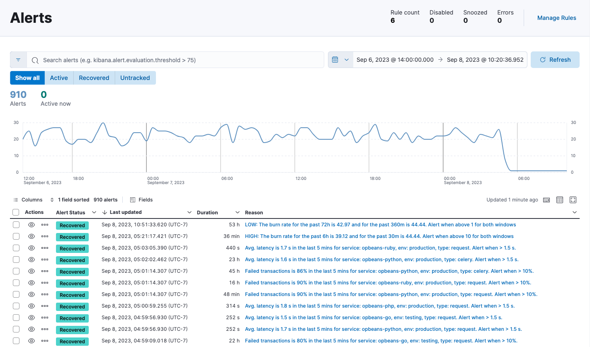

<DocBadge template="technical preview" />

Alerting enables you to define _rules_, which detect complex conditions within different apps and trigger actions when those conditions are met. Alerting provides a set of built-in connectors and rules for you to use. This page describes all of these elements and how they operate together.

## Important concepts

Alerting works by running checks on a schedule to detect conditions defined by a rule. You can define rules at different levels (service, environment, transaction) or use custom KQL queries. When a condition is met, the rule tracks it as an _alert_ and responds by triggering one or more _actions_.

Actions typically involve interaction with Elastic services or third-party integrations. <DocLink slug="/serverless/observability/send-cases-to-an-external-system" text="Connectors"/> enable actions to talk to these services and integrations.

Once you've defined your rules, you can monitor any alerts triggered by these rules in real time, with detailed dashboards that help you quickly identify and troubleshoot any issues that may arise. You can also extend your alerts with notifications via services or third-party incident management systems.

## Alerts page

On the **Alerts** page, the Alerts table provides a snapshot of alerts occurring within the specified time frame. The table includes the alert status, when it was last updated, the reason for the alert, and more.

You can filter this table by alert status or time period, customize the visible columns, and search for specific alerts (for example, alerts related to a specific service or environment) using KQL. Select **View alert detail** from the **More actions** menu <DocIcon type="boxesHorizontal" title="action menu" />, or click the Reason link for any alert to <DocLink slug="/serverless/observability/view-alerts" text="view alert"/> in detail, and you can then either **View in app** or **View rule details**.

## Next steps

* <DocLink slug="/serverless/observability/create-manage-rules" Create and manage rules/>
* <DocLink slug="/serverless/observability/view-alerts" View alerts/>
