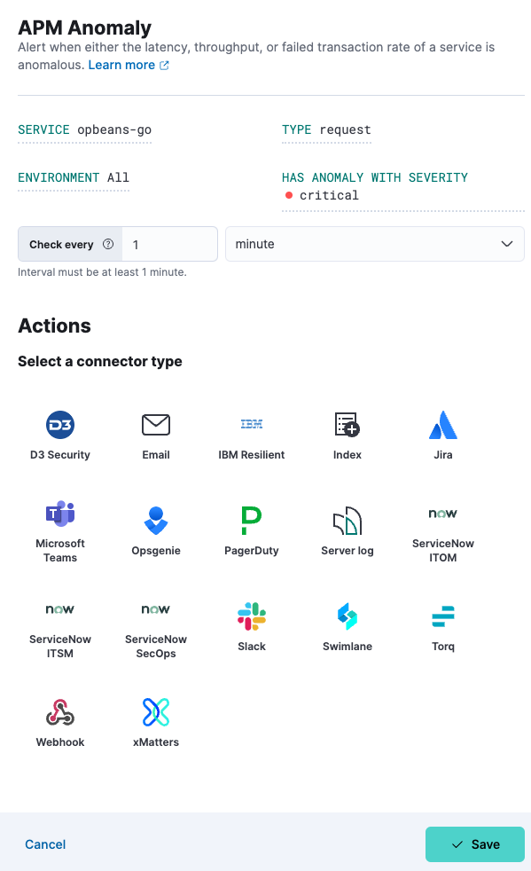
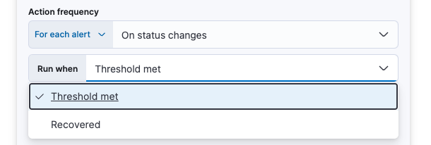

<DocBadge template="technical preview" />

import Connectors from './alerting-connectors.mdx'

import Roles from '../partials/roles.mdx'

<Roles role="Editor" goal="create anomaly rules" />

You can create an anomaly rule to alert you when either the latency, throughput, or failed transaction rate of a service is abnormal. Anomaly rules can be set at different levels: environment, service, and/or transaction type. Add actions to raise alerts via services or third-party integrations (for example, send an email or create a Jira issue).

<DocCallOut title="Tip">
These steps show how to use the **Alerts** UI.
You can also create an anomaly rule directly from any page within **Applications**. Click the **Alerts and rules** button, and select **Create anomaly rule**. When you create a rule this way, the **Name** and **Tags** fields will be prepopulated but you can still change these.
</DocCallOut>

To create your anomaly rule:

1. In your ((observability)) project, go to **Alerts**.
1. Select **Manage Rules** from the **Alerts** page, and select **Create rule**.
1. Enter a **Name** for your rule, and any optional **Tags** for more granular reporting (leave blank if unsure).
1. Select the **APM Anomaly** rule type.
1. Select the appropriate **Service**, **Type**, and **Environment** (or leave **ALL** to include all options).
1. Select the desired severity (critical, major, minor, warning) from **Has anomaly with severity**.
1. Define the interval to check the rule (for example, check every 1 minute).
1. (Optional) Set up **Actions**.
1. **Save** your rule.

## Add actions

You can extend your rules with actions that interact with third-party systems, write to logs or indices, or send user notifications. You can add an action to a rule at any time. You can create rules without adding actions, and you can also define multiple actions for a single rule.

To add actions to rules, you must first create a connector for that service (for example, an email or external incident management system), which you can then use for different rules, each with their own action frequency.

<DocAccordion buttonContent="Connector types">
Connectors provide a central place to store connection information for services and integrations with third party systems.
The following connectors are available when defining actions for alerting rules:

<Connectors />

For more information on creating connectors, refer to <DocLink slug="/serverless/action-connectors">Connectors</DocLink>.

</DocAccordion>

<DocAccordion buttonContent="Action frequency">
After you select a connector, you must set the action frequency. You can choose to create a **Summary of alerts** on each check interval or on a custom interval. For example, you can send email notifications that summarize the new, ongoing, and recovered alerts every twelve hours.

Alternatively, you can set the action frequency to **For each alert** and specify the conditions each alert must meet for the action to run. For example, you can send an email only when the alert status changes to critical.

With the **Run when** menu you can choose if an action runs when the threshold for an alert is reached, or when the alert is recovered. For example, you can add a corresponding action for each state to ensure you are alerted when the rule is triggered and also when it recovers.

</DocAccordion>

<DocAccordion buttonContent="Action variables">
Use the default notification message or customize it.
You can add more context to the message by clicking the Add variable icon <DocIcon type="indexOpen" title="Add variable" /> and selecting from a list of available variables.

The following variables are specific to this rule type.
You can also specify [variables common to all rules](((kibana-ref))/rule-action-variables.html).

<DocDefList>
   <DocDefTerm>`context.alertDetailsUrl`</DocDefTerm>
    <DocDefDescription>
        Link to the alert troubleshooting view for further context and details. This will be an empty string if the `server.publicBaseUrl` is not configured.
    </DocDefDescription>
    <DocDefTerm>`context.environment`</DocDefTerm>
    <DocDefDescription>
        The transaction type the alert is created for.
    </DocDefDescription>
    <DocDefTerm>`context.reason`</DocDefTerm>
    <DocDefDescription>
        A concise description of the reason for the alert.
    </DocDefDescription>
    <DocDefTerm>`context.serviceName`</DocDefTerm>
    <DocDefDescription>
        The service the alert is created for.
    </DocDefDescription>
    <DocDefTerm>`context.threshold`</DocDefTerm>
    <DocDefDescription>
        Any trigger value above this value will cause the alert to fire.
    </DocDefDescription>
    <DocDefTerm>`context.transactionType`</DocDefTerm>
    <DocDefDescription>
        The transaction type the alert is created for.
    </DocDefDescription>
    <DocDefTerm>`context.triggerValue`</DocDefTerm>
    <DocDefDescription>
        The value that breached the threshold and triggered the alert.
    </DocDefDescription>
    <DocDefTerm>`context.viewInAppUrl`</DocDefTerm>
    <DocDefDescription>
        Link to the alert source.
    </DocDefDescription>
</DocDefList>

</DocAccordion>
