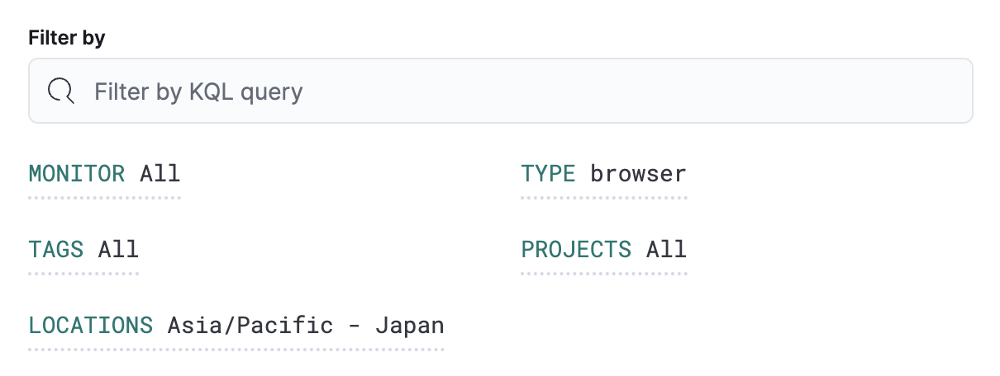
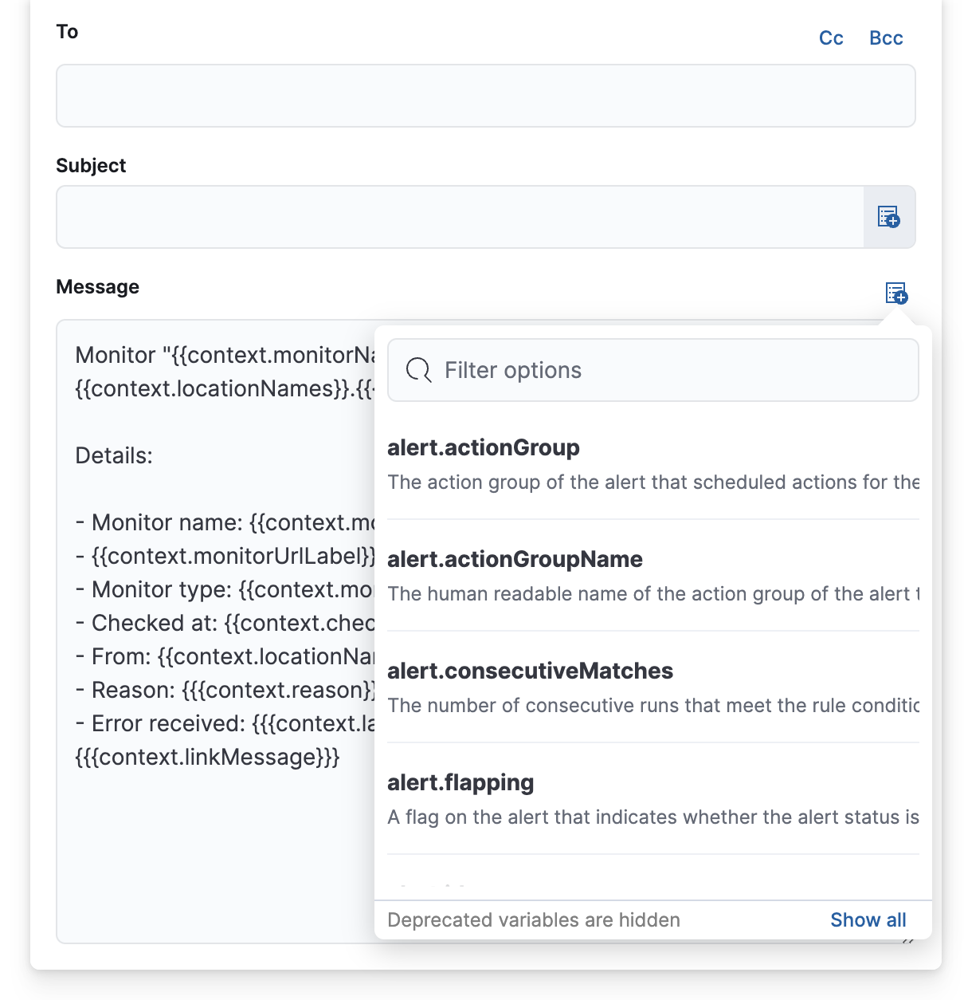

import Connectors from './alerting-connectors.mdx'

Within the Synthetics UI, create a **Monitor Status** rule to receive notifications
based on errors and outages.

1. To access this page, go to **Synthetics** → **Overview**.
1. At the top of the page, click **Alerts and rules** → **Monitor status rule** → **Create status rule**.

## Filters

The **Filter by** section controls the scope of the rule.
The rule will only check monitors that match the filters defined in this section.
In this example, the rule will only alert on `browser` monitors located in `Asia/Pacific - Japan`.

## Conditions

Conditions for each rule will be applied to all monitors that match the filters in the [**Filter by** section](#filters).
You can choose the number of times the monitor has to be down relative to either a number of checks run
or a time range in which checks were run, and the minimum number of locations the monitor must be down in.

<DocCallOut title="Note">
  Retests are included in the number of checks.
</DocCallOut>

The **Rule schedule** defines how often to evaluate the condition. Note that checks are queued, and they run as close
to the defined value as capacity allows. For example, if a check is scheduled to run every 2 minutes, but the check
takes longer than 2 minutes to run, a check will not run until the previous check has finished.

You can also set **Advanced options** such as the number of consecutive runs that must meet the rule conditions before
an alert occurs.

In this example, the conditions will be met any time a `browser` monitor is down `3` of the last `5` times
the monitor ran across any locations that match the filter. These conditions will be evaluated every minute,
and you will only receive an alert when the conditions are met three times consecutively.

## Action types

Extend your rules by connecting them to actions that use the following supported built-in integrations.

<Connectors />

After you select a connector, you must set the action frequency.
You can choose to create a summary of alerts on each check interval or on a custom interval.
For example, send email notifications that summarize the new, ongoing, and recovered alerts each hour:

Alternatively, you can set the action frequency such that you choose how often the action runs
(for example, at each check interval, only when the alert status changes, or at a custom action interval).
In this case, you must also select the specific threshold condition that affects when actions run:
the _Synthetics monitor status_ changes or when it is _Recovered_ (went from down to up).

You can also further refine the conditions under which actions run by specifying that actions only run
when they match a KQL query or when an alert occurs within a specific time frame:

* **If alert matches query**: Enter a KQL query that defines field-value pairs or query conditions that must
  be met for notifications to send. The query only searches alert documents in the indices specified for the rule.
* **If alert is generated during timeframe**: Set timeframe details. Notifications are only sent if alerts are
  generated within the timeframe you define.

### Action variables

Use the default notification message or customize it.
You can add more context to the message by clicking the icon above the message text box
and selecting from a list of available variables.

The following variables are specific to this rule type.
You an also specify [variables common to all rules](((kibana-ref))/rule-action-variables.html).

<DocDefList>
  <DocDefTerm>`context.checkedAt`</DocDefTerm>
  <DocDefDescription>
    Timestamp of the monitor run.
  </DocDefDescription>
  <DocDefTerm>`context.hostName`</DocDefTerm>
  <DocDefDescription>
    Hostname of the location from which the check is performed.
  </DocDefDescription>
  <DocDefTerm>`context.lastErrorMessage`</DocDefTerm>
  <DocDefDescription>
    Monitor last error message.
  </DocDefDescription>
  <DocDefTerm>`context.locationId`</DocDefTerm>
  <DocDefDescription>
    Location id from which the check is performed.
  </DocDefDescription>
  <DocDefTerm>`context.locationName`</DocDefTerm>
  <DocDefDescription>
    Location name from which the check is performed.
  </DocDefDescription>
  <DocDefTerm>`context.locationNames`</DocDefTerm>
  <DocDefDescription>
    Location names from which the checks are performed.
  </DocDefDescription>
  <DocDefTerm>`context.message`</DocDefTerm>
  <DocDefDescription>
    A generated message summarizing the status of monitors currently down.
  </DocDefDescription>
  <DocDefTerm>`context.monitorId`</DocDefTerm>
  <DocDefDescription>
    ID of the monitor.
  </DocDefDescription>
  <DocDefTerm>`context.monitorName`</DocDefTerm>
  <DocDefDescription>
    Name of the monitor.
  </DocDefDescription>
  <DocDefTerm>`context.monitorTags`</DocDefTerm>
  <DocDefDescription>
    Tags associated with the monitor.
  </DocDefDescription>
  <DocDefTerm>`context.monitorType`</DocDefTerm>
  <DocDefDescription>
    Type (for example, HTTP/TCP) of the monitor.
  </DocDefDescription>
  <DocDefTerm>`context.monitorUrl`</DocDefTerm>
  <DocDefDescription>
    URL of the monitor.
  </DocDefDescription>
  <DocDefTerm>`context.reason`</DocDefTerm>
  <DocDefDescription>
    A concise description of the reason for the alert.
  </DocDefDescription>
  <DocDefTerm>`context.recoveryReason`</DocDefTerm>
  <DocDefDescription>
    A concise description of the reason for the recovery.
  </DocDefDescription>
  <DocDefTerm>`context.status`</DocDefTerm>
  <DocDefDescription>
    Monitor status (for example, "down").
  </DocDefDescription>
  <DocDefTerm>`context.viewInAppUrl`</DocDefTerm>
  <DocDefDescription>
    Open alert details and context in Synthetics app.
  </DocDefDescription>
</DocDefList>