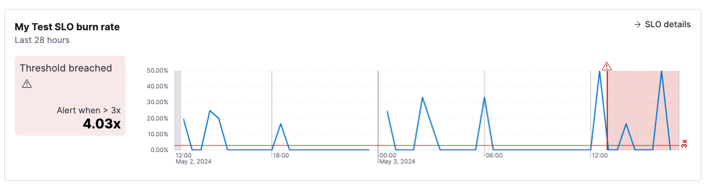

<DocBadge template="technical preview" />

SLO burn rate breaches occur when the percentage of bad events over a specified time period exceeds the threshold set in your <DocLink slug="/serverless/observability/create-slo-burn-rate-alert-rule" text="SLO burn rate rule"/>.
When this happens, you are at risk of exhausting your error budget and violating your SLO.

To triage issues quickly, go to the alert details page:

1. In your Observability project, go to **Alerts** (or open the SLO and click **Alerts**.)
2. From the Alerts table, click the <DocIcon type="boxesHorizontal" size="m" title="More actions" />
icon next to the alert and select **View alert details**.

The alert details page shows information about the alert, including when the alert was triggered,
the duration of the alert, the source SLO, and the rule that triggered the alert.
You can follow the links to navigate to the source SLO or rule definition.

Explore charts on the page to learn more about the SLO breach:

* The first chart shows the burn rate during the time range when the alert was active.
The line indicates how close the SLO came to breaching the threshold.
* The next chart shows the alerts history over the last 30 days.
It shows the number of alerts that were triggered and the average time it took to recover after a breach.
* Both timelines are annotated to show when the threshold was breached.
You can hover over an alert icon to see the timestamp of the alert.

The number, duration, and frequency of these breaches over time gives you an indication of how severely the service is degrading so that you can focus on high severity issues first.

<DocCallOut color="empty|warning|danger" title="Note">
    The contents of the alert details page may vary depending on the type of SLI that's defined in the SLO.
</DocCallOut>

After investigating the alert, you may want to:

* Click **Snooze the rule** to snooze notifications for a specific time period or indefinitely.
* Click the <DocIcon type="boxesVertical" size="m" title="Actions" /> icon and select **Add to case** to add the alert to a new or existing case. To learn more, refer to <DocLink slug="/serverless/observability/cases"/>.
* Click the <DocIcon type="boxesVertical" size="m" title="Actions" /> icon and select **Mark as untracked**.
When an alert is marked as untracked, actions are no longer generated.
You can choose to move active alerts to this state when you disable or delete rules.
