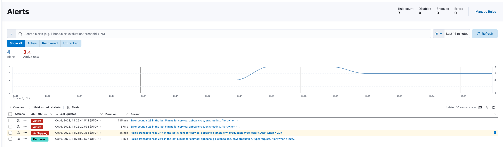

<DocBadge template="technical preview" />

import Roles from '../partials/roles.mdx'

<Roles role="Editor" goal="perform this task" />

You can track and manage alerts for your applications and SLOs from the **Alerts** page. You can filter this view by alert status or time period, or search for specific alerts using KQL. Manage your alerts by adding them to cases or viewing them within the respective UIs.

{/* Is this a page or dashboard? */}

## Filter alerts

To help you get started with your analysis faster, use the KQL bar to create structured queries using
[((kib)) Query Language](((kibana-ref))/kuery-query.html).
{/* TO-DO: Fix example
For example, `kibana.alert.rule.name : <>`.
*/}

You can use the time filter to define a specific date and time range.
By default, this filter is set to search for the last 15 minutes.

You can also filter by alert status using the buttons below the KQL bar.
By default, this filter is set to **Show all** alerts, but you can filter to show only active, recovered or untracked alerts.

## View alert details

There are a few ways to inspect the details for a specific alert.

From the **Alerts** table, you can click on a specific alert to open the alert detail flyout to view a summary of the alert without leaving the page.
There you'll see the current status of the alert, its duration, and when it was last updated.
To help you determine what caused the alert, you can view the expected and actual threshold values, and the rule that produced the alert.

There are three common alert statuses:

`active`
  : The conditions for the rule are met and actions should be generated according to the notification settings.

`flapping`
  : The alert is switching repeatedly between active and recovered states.

`recovered`
  : The conditions for the rule are no longer met and recovery actions should be generated.

`untracked`
  : The corresponding rule is disabled or you've marked the alert as untracked. To mark the alert as untracked, go to the **Alerts** table, click the <DocIcon type="boxesHorizontal" title="More actions"/> icon to expand the _More actions_ menu, and click **Mark as untracked**.
  When an alert is marked as untracked, actions are no longer generated.
  You can choose to move active alerts to this state when you disable or delete rules.

<DocCallOut title="Flapping alerts">
The flapping state is possible only if you have enabled alert flapping detection.
Go to the **Alerts** page and click **Manage Rules** to navigate to the ((observability)) **((rules-app))** page.
Click **Settings** then set the look back window and threshold that are used to determine whether alerts are flapping.
For example, you can specify that the alert must change status at least 6 times in the last 10 runs.
If the rule has actions that run when the alert status changes, those actions are suppressed while the alert is flapping.
</DocCallOut>

{/*  */}

To further inspect the rule:

* From the alert detail flyout, click **View rule details**.
* From the **Alerts** table, click the <DocIcon type="boxesHorizontal" title="More actions" /> icon and select **View rule details**.

To view the alert in the app that triggered it:

* From the alert detail flyout, click **View in app**.
* From the **Alerts** table, click the <DocIcon type="eye" title="View in app" /> icon.

## Customize the alerts table

Use the toolbar buttons in the upper-left of the alerts table to customize the columns you want displayed:

* **Columns**: Reorder the columns.
* **_x_ fields sorted**: Sort the table by one or more columns.
* **Fields**: Select the fields to display in the table.

For example, click **Fields** and choose the `Maintenance Windows` field.
If an alert was affected by a maintenance window, its identifier appears in the new column.
For more information about their impact on alert notifications, refer to <DocLink slug="/serverless/maintenance-windows">Maintenance windows</DocLink>.

{/*  */}

You can also use the toolbar buttons in the upper-right to customize the display options or view the table in full-screen mode.

## Add alerts to cases

From the **Alerts** table, you can add one or more alerts to a case.
Click the <DocIcon type="boxesHorizontal" title="More actions"/> icon to add the alert to a new or existing case.
You can add an unlimited amount of alerts from any rule type.

<DocCallOut>
Each case can have a maximum of 1,000 alerts.
</DocCallOut>

### Add an alert to a new case

To add an alert to a new case:

1. Select **Add to new case**.
1. Enter a case name, add relevant tags, and include a case description.
1. Under **External incident management system**, select a connector. If you've previously added one, that connector displays as the default selection. Otherwise, the default setting is `No connector selected`.
1. After you've completed all of the required fields, click **Create case**. A notification message confirms you successfully created the case. To view the case details, click the notification link or go to the <DocLink slug="/serverless/observability/cases">Cases</DocLink> page.

### Add an alert to an existing case

To add an alert to an existing case:

1. Select **Add to existing case**.
1. Select the case where you will attach the alert. A confirmation message displays.
