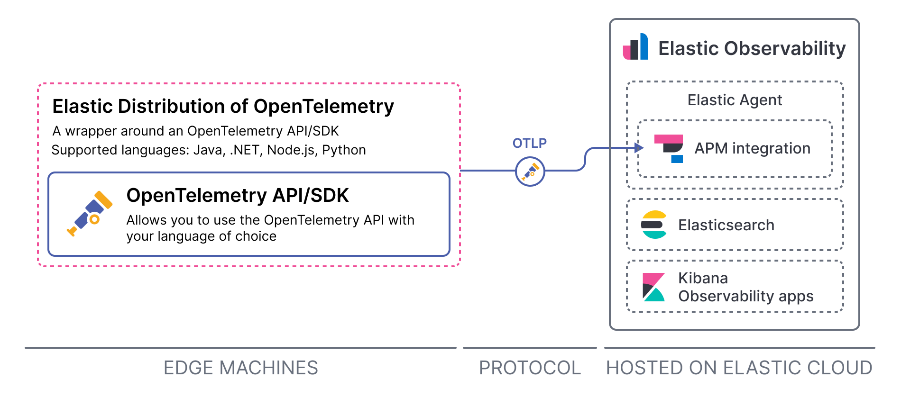
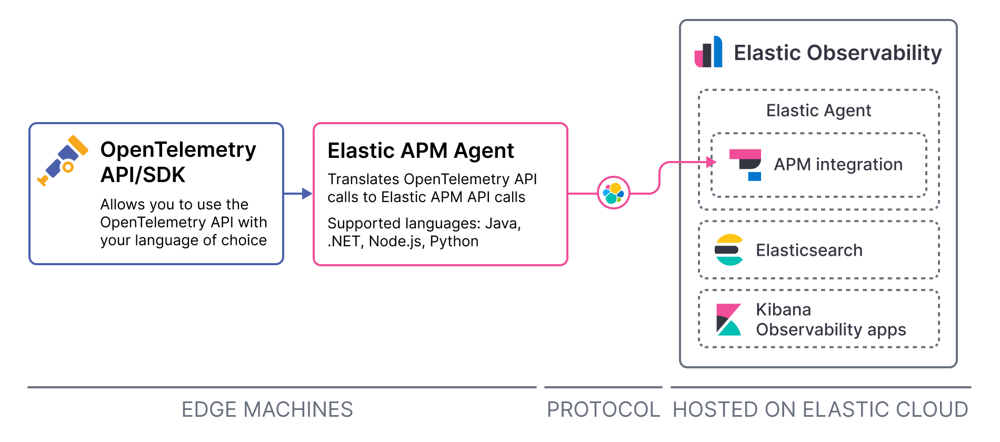
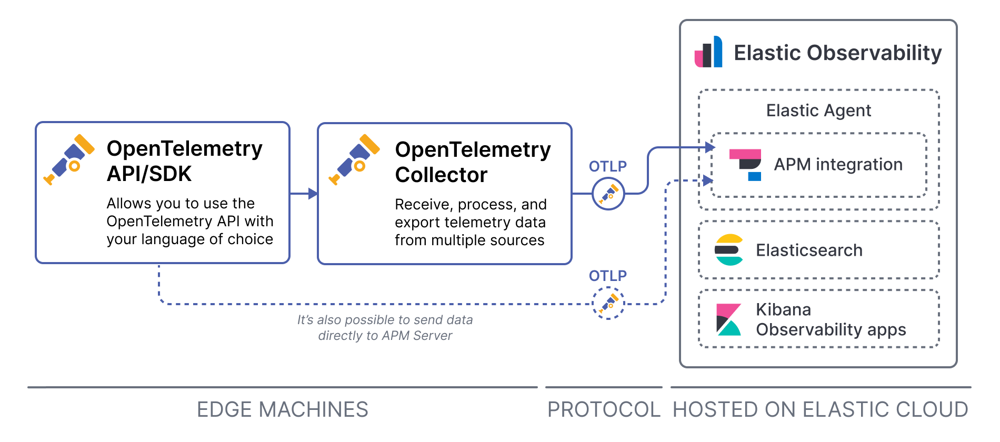

<DocBadge template="technical preview" />

<DocCallOut title="Note">
  For a complete overview of using OpenTelemetry with Elastic, explore [Elastic Distributions of OpenTelemetry](https://github.com/elastic/opentelemetry).
</DocCallOut>

[OpenTelemetry](https://opentelemetry.io/docs/concepts/what-is-opentelemetry/) is a set of APIs, SDKs, tooling, and integrations that enable the capture and management of telemetry data from your services and applications.

Elastic integrates with OpenTelemetry, allowing you to reuse your existing instrumentation to easily send observability data to the Elastic Stack. There are several ways to integrate OpenTelemetry with the Elastic Stack:

* [Elastic Distributions of OpenTelemetry language SDKs](#elastic-distributions-of-opentelemetry-language-sdks)
* [Upstream OpenTelemetry API/SDK + Elastic APM agent](#upstream-opentelemetry-apisdk--elastic-apm-agent)
* [Upstream OpenTelemetry Collector and language SDKs](#upstream-opentelemetry-collector-and-language-sdks)
* [AWS Lambda collector exporter](#aws-lambda-collector-exporter)

## Elastic Distributions of OpenTelemetry language SDKs

<DocCallOut template="technical_preview" />

Elastic offers several distributions of OpenTelemetry language SDKs. A _distribution_ is a customized version of an upstream OpenTelemetry repository. Each Elastic Distribution of OpenTelemetry is a customized version of an [OpenTelemetry language SDK](https://opentelemetry.io/docs/languages/).

With an Elastic Distribution of OpenTelemetry language SDK you have access to all the features of the OpenTelemetry SDK that it customizes, plus:

* You may get access to SDK improvements and bug fixes contributed by the Elastic team _before_ the changes are available upstream in the OpenTelemetry repositories.
* The distribution preconfigures the collection of tracing and metrics signals, applying some opinionated defaults, such as which sources are collected by default.

{/* Why you wouldn't choose this method */}
{/* Just that it's still in tech preview? */}

{/* Where to go next */}
Get started with an Elastic Distribution of OpenTelemetry language SDK:

* [**Elastic Distribution of OpenTelemetry Java →**](https://github.com/elastic/elastic-otel-java)
* <DocBadge template="technical preview" /> [**Elastic Distribution of OpenTelemetry .NET →**](https://github.com/elastic/elastic-otel-dotnet)
* <DocBadge template="technical preview" /> [**Elastic Distribution of OpenTelemetry Node.js →**](https://github.com/elastic/elastic-otel-node)
* <DocBadge template="technical preview" /> [**Elastic Distribution of OpenTelemetry Python →**](https://github.com/elastic/elastic-otel-python)
* <DocBadge template="technical preview" /> [**Elastic Distribution of OpenTelemetry PHP →**](https://github.com/elastic/elastic-otel-php)

<DocCallOut title="Note">
  For more details about OpenTelemetry distributions in general, visit the [OpenTelemetry documentation](https://opentelemetry.io/docs/concepts/distributions).
</DocCallOut>

## Upstream OpenTelemetry API/SDK + Elastic APM agent

Use the OpenTelemetry API/SDKs with <DocLink slug="/serverless/observability/apm-agents-elastic-apm-agents">Elastic APM agents</DocLink> to translate OpenTelemetry API calls to Elastic APM API calls.

{/* Why you _would_ choose this method */}
This allows you to reuse your existing OpenTelemetry instrumentation to create Elastic APM transactions and spans &mdash; avoiding vendor lock-in and having to redo manual instrumentation.

{/* Why you would _not_ choose this method */}
However, not all features of the OpenTelemetry API are supported when using this approach, and not all Elastic APM agents support this approach.

{/* Where to go next */}
Find more details about how to use an OpenTelemetry API or SDK with an Elastic APM agent and which OpenTelemetry API features are supported in the APM agent documentation:

* [**APM Java agent →**](https://www.elastic.co/guide/en/apm/agent/java/current/opentelemetry-bridge.html)
* [**APM .NET agent →**](https://www.elastic.co/guide/en/apm/agent/dotnet/current/opentelemetry-bridge.html)
* [**APM Node.js agent →**](https://www.elastic.co/guide/en/apm/agent/nodejs/current/opentelemetry-bridge.html)
* [**APM Python agent →**](https://www.elastic.co/guide/en/apm/agent/python/current/opentelemetry-bridge.html)

## Upstream OpenTelemetry Collector and language SDKs

The Elastic Stack natively supports the OpenTelemetry protocol (OTLP). This means trace data and metrics collected from your applications and infrastructure by an OpenTelemetry Collector or OpenTelemetry language SDK can be sent to the Elastic Stack.

You can set up an [OpenTelemetry Collector](https://opentelemetry.io/docs/collector/), instrument your application with an [OpenTelemetry language SDK](https://opentelemetry.io/docs/languages/) that sends data to the collector, and use the collector to process and export the data to APM Server.

<DocCallOut title="Note">
  It's also possible to send data directly to APM Server from an upstream OpenTelemetry SDK. You might do this during development or if you're monitoring a small-scale application. Read more about when to use a collector in the [OpenTelemetry documentation](https://opentelemetry.io/docs/collector/#when-to-use-a-collector).
</DocCallOut>

{/* Why you _would_ choose this approach */}
This approach works well when you need to instrument a technology that Elastic doesn't provide a solution for. For example, if you want to instrument C or C++ you could use the [OpenTelemetry C++ client](https://github.com/open-telemetry/opentelemetry-cpp).
{/* Other languages include erlang, lua, perl. */}

{/* Why you would _not_ choose this approach */}
However, there are some limitations when using collectors and language SDKs built and maintainedby OpenTelemetry, including:

* Elastic can't provide implementation support on how to use upstream OpenTelemetry tools.
* You won't have access to Elastic enterprise APM features.
* You may experience problems with performance efficiency.

For more on the limitations associated with using upstream OpenTelemetry tools, refer to <DocLink slug="/serverless/observability/apm-agents-opentelemetry-limitations" />.

{/* Where to go next */}
<DocLink slug="/serverless/observability/apm-agents-opentelemetry-opentelemetry-native-support">**Get started with upstream OpenTelemetry Collectors and language SDKs →**</DocLink>

## AWS Lambda collector exporter

AWS Lambda functions can be instrumented with OpenTelemetry and monitored with Elastic Observability.

{/* Do we want to say anything about why you would/wouldn't choose this method to send data to Elastic? */}

{/* Where to go next */}
To get started, follow the official AWS Distro for OpenTelemetry Lambda documentation, and configure the OpenTelemetry Collector to output traces and metrics to your Elastic cluster:

<a target="_blank" href="https://aws-otel.github.io/docs/getting-started/lambda">**Get started with the AWS Distro for OpenTelemetry Lambda**</a>
