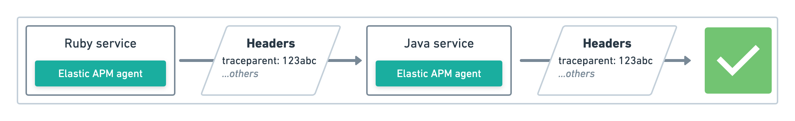
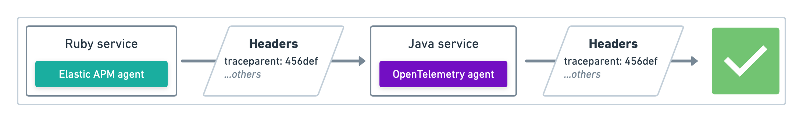
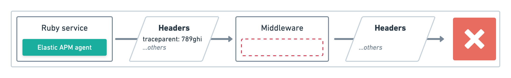

<DocBadge template="technical preview" />

import TabWidgetsDistributedTraceSendWidget from '../transclusion/apm/guide/tab-widgets/distributed-trace-send-widget.mdx'
import TabWidgetsDistributedTraceReceiveWidget from '../transclusion/apm/guide/tab-widgets/distributed-trace-receive-widget.mdx'

A `trace` is a group of <DocLink slug="/serverless/observability/apm-data-types">transactions</DocLink> and <DocLink slug="/serverless/observability/apm-data-types">spans</DocLink> with a common root.
Each `trace` tracks the entirety of a single request.
When a `trace` travels through multiple services, as is common in a microservice architecture,
it is known as a distributed trace.

## Why is distributed tracing important?

Distributed tracing enables you to analyze performance throughout your microservice architecture
by tracing the entirety of a request &mdash; from the initial web request on your front-end service
all the way to database queries made on your back-end services.

Tracking requests as they propagate through your services provides an end-to-end picture of
where your application is spending time, where errors are occurring, and where bottlenecks are forming.
Distributed tracing eliminates individual service's data silos and reveals what's happening outside of
service borders.

For supported technologies, distributed tracing works out-of-the-box, with no additional configuration required.

## How distributed tracing works

Distributed tracing works by injecting a custom `traceparent` HTTP header into outgoing requests.
This header includes information, like `trace-id`, which is used to identify the current trace,
and `parent-id`, which is used to identify the parent of the current span on incoming requests
or the current span on an outgoing request.

When a service is working on a request, it checks for the existence of this HTTP header.
If it's missing, the service starts a new trace.
If it exists, the service ensures the current action is added as a child of the existing trace,
and continues to propagate the trace.

### Trace propagation examples

In this example, Elastic's Ruby agent communicates with Elastic's Java agent.
Both support the `traceparent` header, and trace data is successfully propagated.

In this example, Elastic's Ruby agent communicates with OpenTelemetry's Java agent.
Both support the `traceparent` header, and trace data is successfully propagated.

In this example, the trace meets a piece of middleware that doesn't propagate the `traceparent` header.
The distributed trace ends and any further communication will result in a new trace.

### W3C Trace Context specification

All Elastic agents now support the official W3C Trace Context specification and `traceparent` header.
See the table below for the minimum required agent version:

| Agent name | Agent Version |
|---|---|
| **Go Agent** | ≥`1.6` |
| **Java Agent** | ≥`1.14` |
| **.NET Agent** | ≥`1.3` |
| **Node.js Agent** | ≥`3.4` |
| **PHP Agent** | ≥`1.0` |
| **Python Agent** | ≥`5.4` |
| **Ruby Agent** | ≥`3.5` |

<DocCallOut title="Note">
Older Elastic agents use a unique `elastic-apm-traceparent` header.
For backward-compatibility purposes, new versions of Elastic agents still support this header.
</DocCallOut>

## Visualize distributed tracing

APM's timeline visualization provides a visual deep-dive into each of your application's traces:

## Manual distributed tracing

Elastic agents automatically propagate distributed tracing context for supported technologies.
If your service communicates over a different, unsupported protocol,
you can manually propagate distributed tracing context from a sending service to a receiving service
with each agent's API.

### Add the `traceparent` header to outgoing requests

Sending services must add the `traceparent` header to outgoing requests.

<TabWidgetsDistributedTraceSendWidget />

### Parse the `traceparent` header on incoming requests

Receiving services must parse the incoming `traceparent` header,
and start a new transaction or span as a child of the received context.

<TabWidgetsDistributedTraceReceiveWidget />
