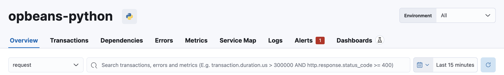

<DocBadge template="technical preview" />

Global filters are ways you can filter your APM data based on a specific
time range or environment. When viewing a specific service, the filter persists
as you move between tabs.

<DocCallOut title="Note">

If you prefer to use advanced queries on your data to filter on specific pieces
of information, see <DocLink slug="/serverless/observability/apm-query-your-data">Query your data</DocLink>.

</DocCallOut>

## Global time range

The global time range filter restricts APM data to a specific time period.

## Service environment filter

The environment selector is a global filter for `service.environment`.
It allows you to view only relevant data and is especially useful for separating development from production environments.
By default, all environments are displayed. If there are no environment options, you'll see "not defined".

Service environments are defined when configuring your APM agents.
It's vital to be consistent when naming environments in your APM agents.
To learn how to configure service environments, see the specific APM agent documentation:

* **Go:** [`ELASTIC_APM_ENVIRONMENT`](((apm-go-ref))/configuration.html#config-environment)
* **Java:** [`environment`](((apm-java-ref))/config-core.html#config-environment)
* **.NET:** [`Environment`](((apm-dotnet-ref))/config-core.html#config-environment)
* **Node.js:** [`environment`](((apm-node-ref))/configuration.html#environment)
* **PHP:** [`environment`](((apm-php-ref))/configuration-reference.html#config-environment)
* **Python:** [`environment`](((apm-py-ref))/configuration.html#config-environment)
* **Ruby:** [`environment`](((apm-ruby-ref))/configuration.html#config-environment)
{/* * **iOS agent:** _Not yet supported_ */}
{/* * **Real User Monitoring:** [`environment`](((apm-rum-ref))/configuration.html#environment) */}

