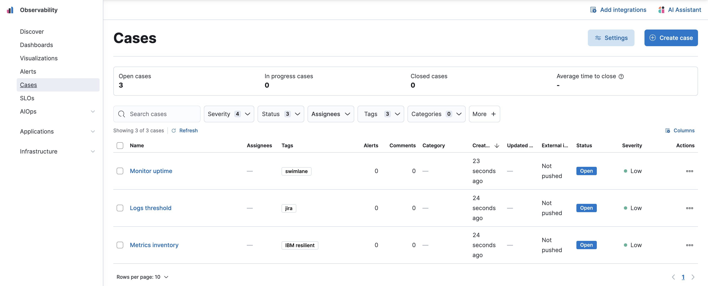

<DocBadge template="technical preview" />

Collect and share information about observability issues by creating a case.
Cases allow you to track key investigation details,
add assignees and tags to your cases, set their severity and status, and add alerts,
comments, and visualizations. You can also send cases to third-party systems by
<DocLink slug="/serverless/observability/send-cases-to-an-external-system">configuring external connectors</DocLink>.

{/* NOTE: This is an autogenerated screenshot. Do not edit it directly. */}