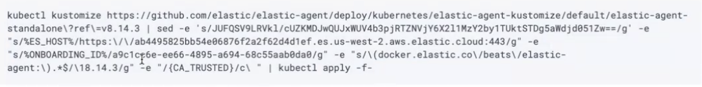
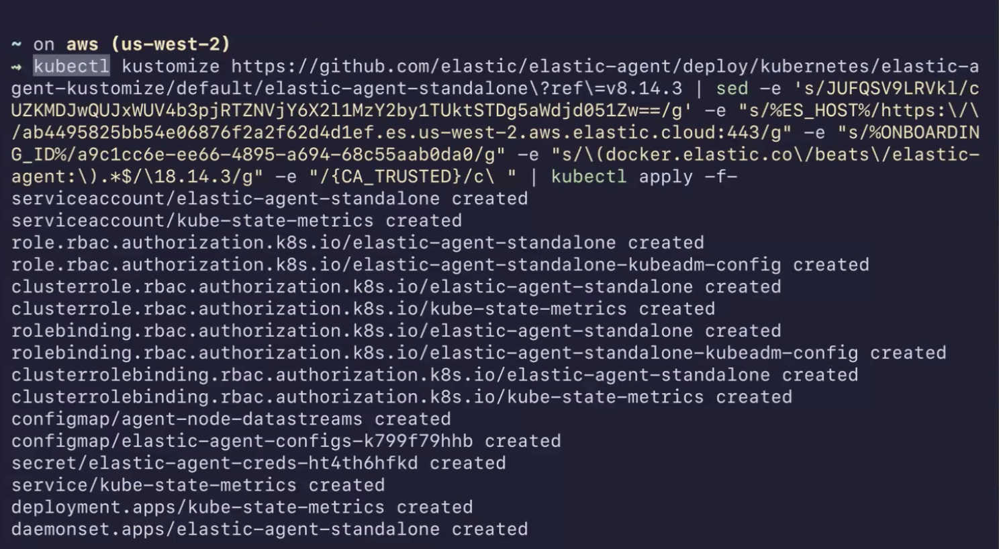

<DocBadge template="technical preview" />

<DocCallOut title="Before you begin">
   This quickstart has the following requirements:

   - The **Admin** role or higher is required to onboard system logs and metrics. To learn more, refer to <DocLink slug="/serverless/general/assign-user-roles" />.
   - You have a running Kubernetes cluster.
   - You have installed Kubectl. 
</DocCallOut>

In this quickstart guide, you'll learn how to create the Kubernetes resources that are required to monitor your cluster infrastructure by collecting metrics with Elastic Agent. 

This new approach requires minimal configuration and provides you with an easy setup to monitor your clusters. You no longer need to download, install, or configure the Elastic Agent, everything happens automatically when you run the kubectl command.

Then, you will navigate to dashboards to further analyze and explore your observability data.

1. <DocLink slug="/serverless/observability/create-an-observability-project">Create a new ((observability)) project</DocLink>, or open an existing one.
1. In your ((observability)) project, go to **Add Data**.
1. Select **Monitor infrastructure**, and then select **Kubernetes**.
1. Copy the command that's shown. For example:
  
1. Open a terminal on the cluster you want to monitor, and run the command.

  The kubectl command installs the Elastic Agent in your Kubernetes cluster, downloads all the Kubernetes resources needed to collect metrics from the cluster, and sends it to Elastic.

  The kubectl command generates an output similar to the following one:

  

1. Go back to the *Add Observability Data* page, and you will see the message *We are monitoring your cluster*. 

1. Click *Explore Kubernetes cluster* to open a list of pre-made dashboards displaying your ingested logs and metrics.

## Get value out of your data

TBD

Refer to <DocLink slug="/serverless/observability/serverless-observability-overview"/> for a description of other useful features.
