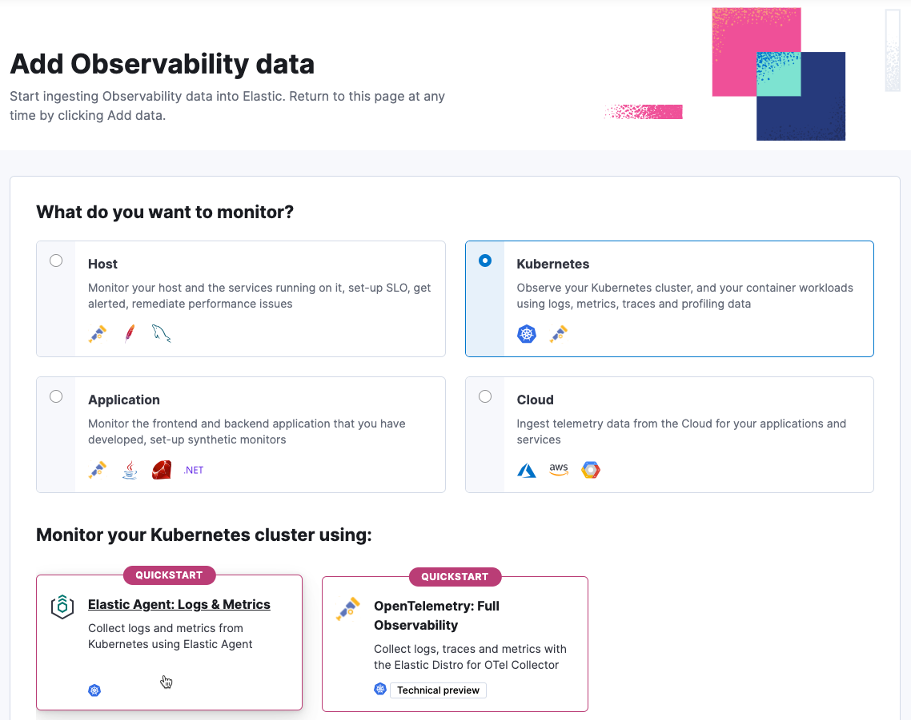
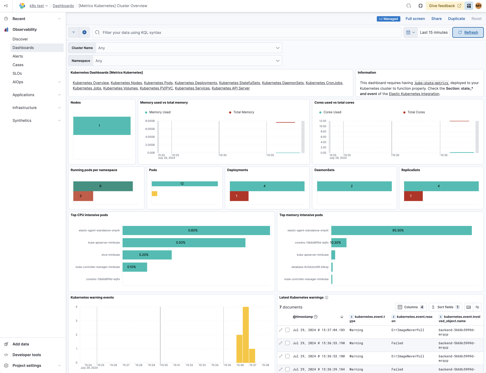

<DocBadge template="technical preview" />

In this quickstart guide, you'll learn how to create the Kubernetes resources that are required to monitor your cluster infrastructure.

This new approach requires minimal configuration and provides you with an easy setup to monitor your infrastructure. You no longer need to download, install, or configure the Elastic Agent, everything happens automatically when you run the kubectl command.

The kubectl command installs the standalone Elastic Agent in your Kubernetes cluster, downloads all the Kubernetes resources needed to collect metrics from the cluster, and sends it to Elastic.

## Prerequisites

- An ((observability)) project. To learn more, refer to <DocLink slug="/serverless/observability/create-an-observability-project" />.
- A user with the **Admin** role or higher—required to onboard system logs and metrics. To learn more, refer to <DocLink slug="/serverless/general/assign-user-roles">Assign user roles and privileges</DocLink>.
- A running Kubernetes cluster.
- [Kubectl](https://kubernetes.io/docs/reference/kubectl/).

## Collect your data

1. <DocLink slug="/serverless/observability/create-an-observability-project">Create a new ((observability)) project</DocLink>, or open an existing one.
1. In your ((observability)) project, go to **Add Data**.
1. Select **Monitor infrastructure**, and then select **Kubernetes**.

    
1. To install the Elastic Agent on your host, copy and run the install command.

   You will use the kubectl command to download a manifest file, inject user's API key generated by Kibana, and create the Kubernetes resources.

1. Go back to the **Add Observability Data** page.
   There might be a slight delay before data is ingested. When ready, you will see the message **We are monitoring your cluster**.

1. Click **Explore Kubernetes cluster** to navigate to dashboards and explore your data.

## Visualize your data

After installation is complete and all relevant data is flowing into Elastic,
the **Visualize your data** section allows you to access the Kubernetes Cluster Overview dashboard that can be used to monitor the health of the cluster.

Furthermore, you can access other useful prebuilt dashboards for monitoring Kubernetes resources, for example running pods per namespace, as well as the resources they consume, like CPU and memory.

Refer to <DocLink slug="/serverless/observability/serverless-observability-overview"/> for a description of other useful features.
