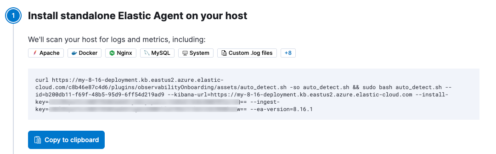
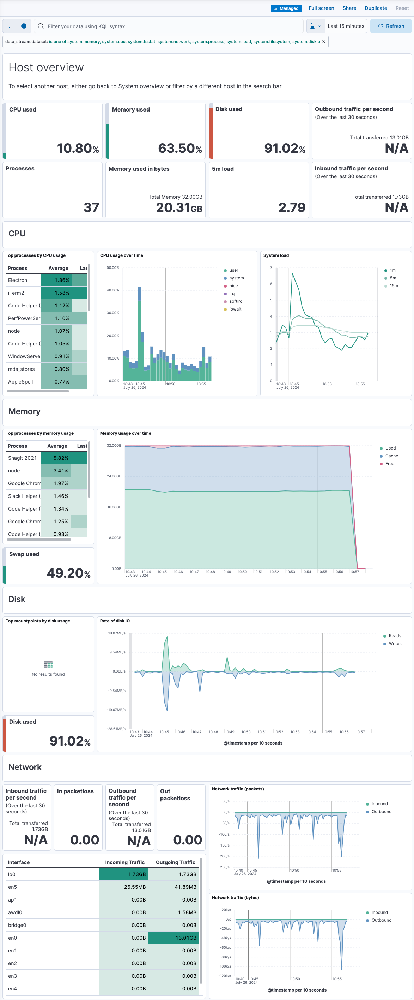

<DocBadge template="technical preview" />

In this quickstart guide, you'll learn how to scan your host to detect and collect logs and metrics,
then navigate to dashboards to further analyze and explore your observability data.
You'll also learn how to get value out of your observability data.

To scan your host, you'll run an auto-detection script that downloads and installs ((agent)),
which is used to collect observability data from the host and send it to Elastic.

The script also generates an ((agent)) configuration file that you can use with your existing Infrastructure-as-Code tooling.

## Prerequisites

- An ((observability)) project. To learn more, refer to <DocLink slug="/serverless/observability/create-an-observability-project" />.
- A user with the **Admin** role or higher—required to onboard system logs and metrics. To learn more, refer to <DocLink slug="/serverless/general/assign-user-roles">Assign user roles and privileges</DocLink>.
- Root privileges on the host—required to run the auto-detection script used in this quickstart.

## Limitations

- The auto-detection script currently scans for metrics and logs from Apache, Docker, Nginx, and the host system.
   It also scans for custom log files.
- The auto-detection script works on Linux and MacOS only. Support for the `lsof` command is also required if you want to detect custom log files.
- If you've installed Apache or Nginx in a non-standard location, you'll need to specify log file paths manually when you run the scan.
- Because Docker Desktop runs in a VM, its logs are not auto-detected.

## Collect your data

1. <DocLink slug="/serverless/observability/create-an-observability-project">Create a new ((observability)) project</DocLink>, or open an existing one.
1. In your ((observability)) project, go to **Add Data**.
1. Select **Collect and analyze logs**, and then select **Auto-detect logs and metrics**.
1. Copy the command that's shown. For example:

    

    You'll run this command to download the auto-detection script and scan your system for observability data.
1. Open a terminal on the host you want to scan, and run the command.
1. Review the list of log files:
    - Enter `Y` to ingest all the log files listed.
    - Enter `n` to either exclude log files or specify additional log paths. Enter `Y` to confirm your selections.

  When the script is done, you'll see a message like "((agent)) is configured and running."

There might be a slight delay before logs and other data are ingested.

<DocCallOut title="Need to scan your host again?">
  You can re-run the script on the same host to detect additional logs.
  The script will scan the host and reconfigure ((agent)) with any additional logs that are found.
  If the script misses any custom logs, you can add them manually by entering `n` after the script has finished scanning the host.
</DocCallOut>

## Visualize your data

After installation is complete and all relevant data is flowing into Elastic,
the **Visualize your data** section will show links to assets you can use to analyze your data.
Depending on what type of observability data was collected,
the page may link to the following integration assets:

<DocTable columns={[{ title: "Integration asset" }, { title: "Description" }]}>
  <DocRow>
    <DocCell>**System**</DocCell>
    <DocCell>Prebuilt dashboard for monitoring host status and health using system metrics.</DocCell>
  </DocRow>
  <DocRow>
    <DocCell>**Apache**</DocCell>
    <DocCell>Prebuilt dashboard for monitoring Apache HTTP server health using error and access log data.</DocCell>
  </DocRow>
  <DocRow>
    <DocCell>**Docker**</DocCell>
    <DocCell>Prebuilt dashboard for monitoring the status and health of Docker containers.</DocCell>
  </DocRow>
  <DocRow>
    <DocCell>**Nginx**</DocCell>
    <DocCell>Prebuilt dashboard for monitoring Nginx server health using error and access log data.</DocCell>
  </DocRow>
  <DocRow>
    <DocCell>**Custom .log files**</DocCell>
    <DocCell>Logs Explorer for analyzing custom logs.</DocCell>
  </DocRow>
</DocTable>

For example, you can navigate the **Host overview** dashboard to explore detailed metrics about system usage and throughput.
Metrics that indicate a possible problem are highlighted in red.

## Get value out of your data

After using the dashboards to examine your data and confirm you've ingested all the host logs and metrics you want to monitor,
you can use Elastic ((observability)) to gain deeper insight into your data.

For host monitoring, the following capabilities and features are recommended:

- In the <DocLink slug="/serverless/observability/infrastructure-monitoring">Infrastructure UI</DocLink>, analyze and compare data collected from your hosts.
You can also:
  - <DocLink slug="/serverless/observability/detect-metric-anomalies">Detect anomalies</DocLink> for memory usage and network traffic on hosts.
  - <DocLink slug="/serverless/observability/alerting">Create alerts</DocLink> that notify you when an anomaly is detected or a metric exceeds a given value.
- In the <DocLink slug="/serverless/observability/discover-and-explore-logs">Logs Explorer</DocLink>, search and filter your log data,
get information about the structure of log fields, and display your findings in a visualization.
You can also:
  - <DocLink slug="/serverless/observability/monitor-datasets">Monitor log data set quality</DocLink> to find degraded documents.
  - <DocLink slug="/serverless/observability/run-log-pattern-analysis">Run a pattern analysis</DocLink> to find patterns in unstructured log messages.
  - <DocLink slug="/serverless/observability/alerting">Create alerts</DocLink> that notify you when an Observability data type reaches or exceeds a given value.
- Use <DocLink slug="/serverless/observability/aiops">AIOps features</DocLink> to apply predictive analytics and machine learning to your data:
  - <DocLink slug="/serverless/observability/aiops-detect-anomalies">Detect anomalies</DocLink> by comparing real-time and historical data from different sources to look for unusual, problematic patterns.
  - <DocLink slug="/serverless/observability/aiops-analyze-spikes">Analyze log spikes and drops</DocLink>.
  - <DocLink slug="/serverless/observability/aiops-detect-change-points">Detect change points</DocLink> in your time series data.

Refer to <DocLink slug="/serverless/observability/serverless-observability-overview"/> for a description of other useful features.
