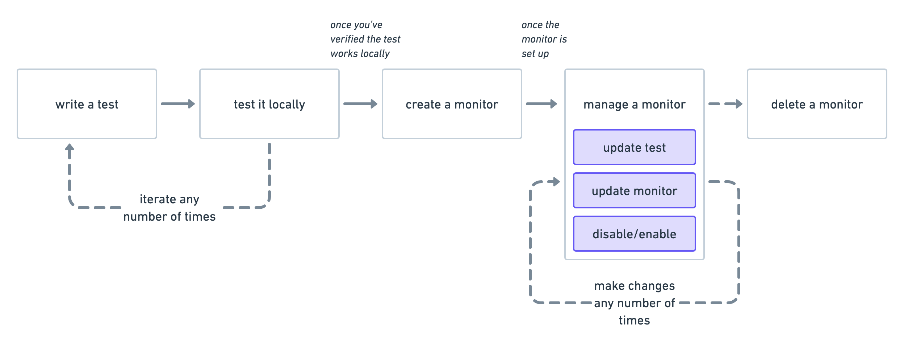

<DocBadge template="technical preview" />

Browser monitors are a type of synthetic monitor.
Synthetic monitoring extends traditional end-to-end testing techniques because it allows your tests to run continuously on the cloud.
With synthetic monitoring, you can assert that your application continues to work after a deployment by reusing
the same journeys that you used to validate the software on your machine.

You can use synthetic monitors to detect bugs caused by invalid states you couldn't predict and didn't write tests for.
Synthetic monitors can also help you catch bugs in features that don't get much traffic by allowing you to periodically simulate users' actions.

Start by learning the basics of synthetic monitoring, including how to:

* <DocLink slug="/serverless/observability/synthetics-create-test">Write a synthetic test</DocLink>
* <DocLink slug="/serverless/observability/synthetics-create-test" section="test-locally">Test locally</DocLink>
* <DocLink slug="/serverless/observability/synthetics-monitor-use">Configure individual browser monitors</DocLink>
* <DocLink slug="/serverless/observability/synthetics-params-secrets">Work with params and secrets</DocLink>
* <DocLink slug="/serverless/observability/synthetics-recorder">Use the Synthetics Recorder</DocLink>

