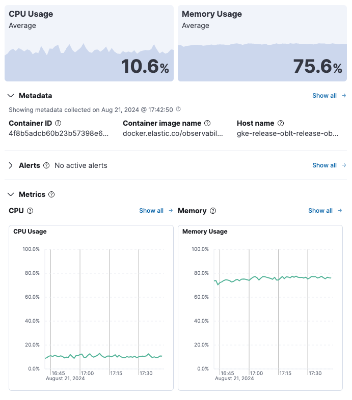
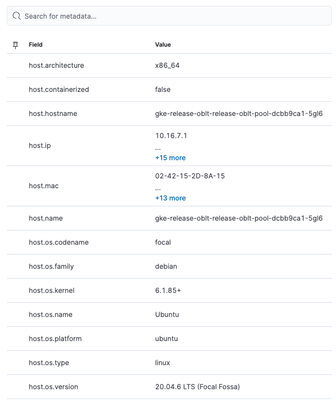
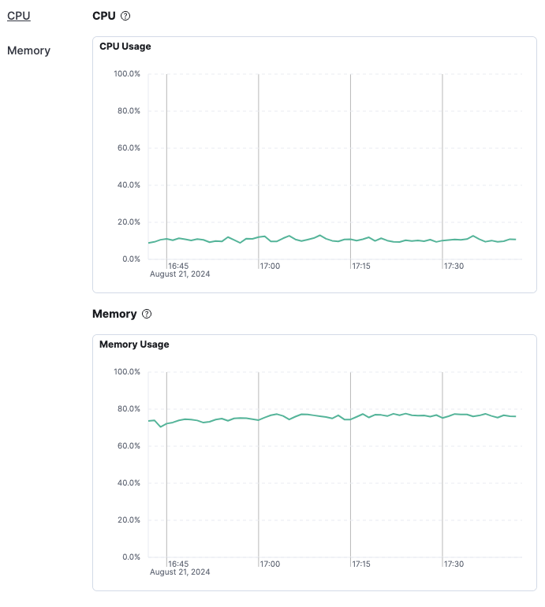
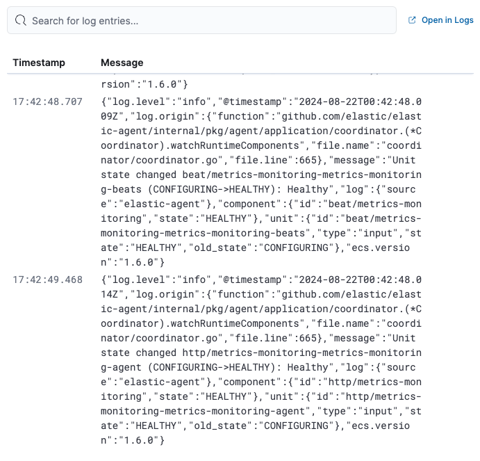

{/* This is collapsed by default */}

<DocAccordion buttonContent="Overview">

The **Overview** tab displays displays key metrics about the selected container, such as CPU, memory, network, and disk usage.
The metrics shown may vary depending on the type of container you're monitoring.

Change the time range to view metrics over a specific period of time.

Expand each section to view more detail related to the selected container, such as metadata,
active alerts, and metrics.

Hover over a specific time period on a chart to compare the various metrics at that given time.

Click **Show all** to drill down into related data.

</DocAccordion>

<DocAccordion buttonContent="Metadata">

The **Metadata** tab lists all the meta information relating to the container:

* Host information
* Cloud information
* Agent information

All of this information can help when investigating events—for example, filtering by operating system or architecture.

</DocAccordion>

<DocAccordion buttonContent="Metrics">

The **Metrics** tab shows container metrics organized by type.

</DocAccordion>

<DocAccordion buttonContent="Logs">

The **Logs** tab displays logs relating to the container that you have selected. By default, the logs tab displays the following columns.

|  |  |
|---|---|
| **Timestamp** | The timestamp of the log entry from the `timestamp` field.  |
| **Message** | The message extracted from the document. The content of this field depends on the type of log message. If no special log message type is detected, the [Elastic Common Schema (ECS)](((ecs-ref))/ecs-base.html) base field, `message`, is used. |

To view the logs in the ((logs-app)) for a detailed analysis, click **Open in Logs**.

</DocAccordion>
