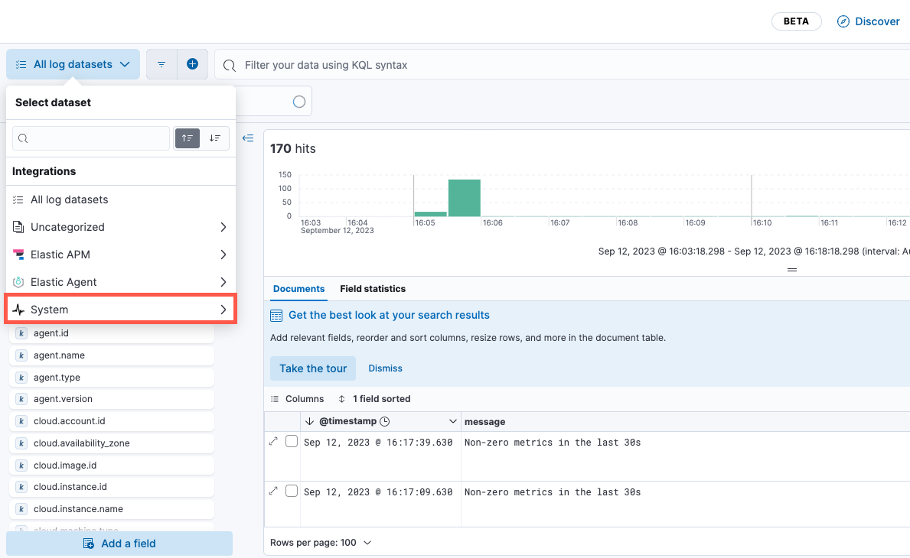

<DocBadge template="technical preview" />

import Roles from '../partials/roles.mdx'

<Roles role="Admin" goal="onboard log data" />

In this guide you'll learn how to onboard system log data from a machine or server,
then observe the data in **Logs Explorer**.

To onboard system log data:

1. <DocLink id="serverlessObservabilityCreateAnObservabilityProject">Create a new ((observability)) project</DocLink>, or open an existing one.
1. In your ((observability)) project, go to **Get Started**.
1. Under **Stream host system logs**, click **Get started**.
When the page loads, the system integration is installed automatically, and a new API key is created.
Make sure you copy the API key and store it in a secure location.
1. Follow the in-product steps to install and configure the ((agent)).
Notice that you can choose to download the agent's config automatically to avoid adding it manually.

After the agent is installed and successfully streaming log data, you can view the data in the UI:

1. From the navigation menu, go to **Discover** and select the **Logs Explorer** tab. The view shows all log datasets.
Notice you can add fields, change the view, expand a document to see details,
and perform other actions to explore your data.
1. Click **All log datasets** and select **System** → **syslog** to show syslog logs.

## Next steps

Now that you've added system logs and explored your data,
learn how to onboard other types of data:

* <DocLink id="serverlessObservabilityStreamLogFiles"/>
* <DocLink id="serverlessObservabilityApmGetStarted"/>

To onboard other types of data, select **Get Started** from the main menu.

