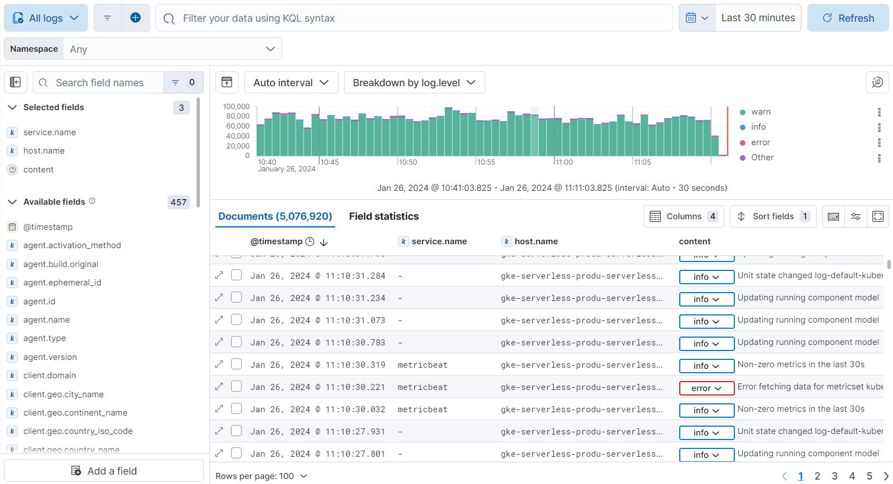

<DocBadge template="technical preview" />

With **Log Explorer**, you can quickly search and filter your log data, get information about the structure of log fields, and display your findings in a visualization.
You can also customize and save your searches and place them on a dashboard.
Instead of having to log into different servers, change directories, and view individual files, all your logs are available in a single view.

