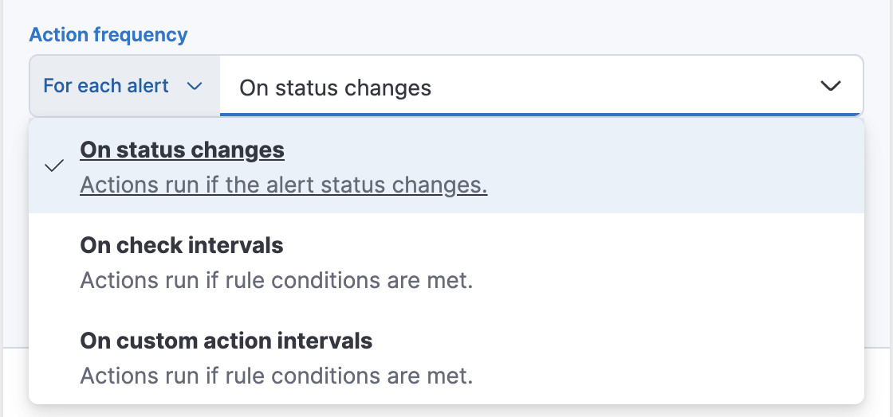
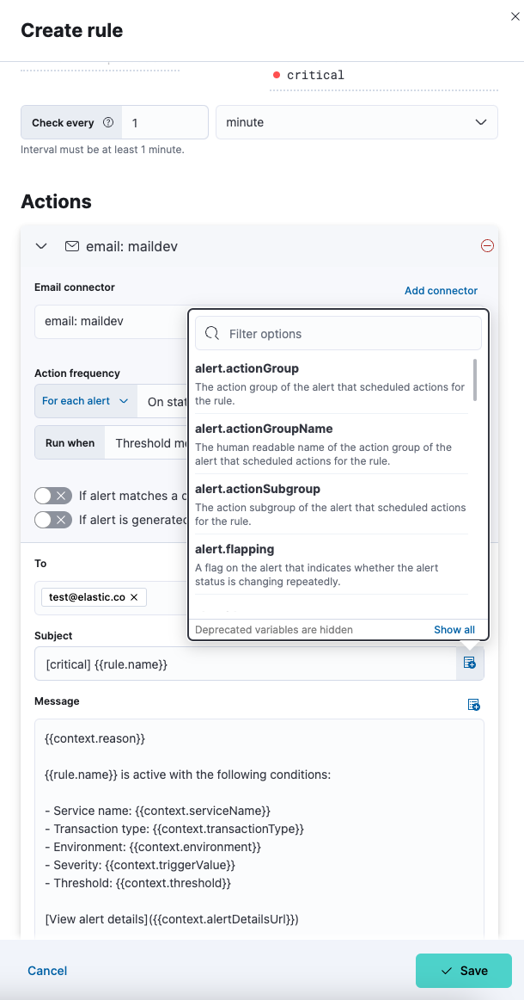

## Actions

You can extend your rules with actions that interact with third-party systems, write to logs or indices, or send user notifications. You can add an action to a rule at any time. You can create rules without adding actions, and you can also define multiple actions for a single rule. 

To add actions to rules, you must first create a connector for that service (for example, an email or external incident management system), which you can then use for different rules, each with their own action frequency. For more information on creating connectors, refer to <DocLink id="serverlessActionConnectors">Connectors</DocLink>.

<DocAccordion buttonContent="Action types">
Actions are services or integrations with third-party systems that run as background tasks when rule conditions are met. The following built-in integrations are supported:

</DocAccordion>

<DocAccordion buttonContent="Action frequency">
After you select a connector, you must set the action frequency. You can choose to create a **Summary of alerts** on each check interval or on a custom interval. For example, you can send email notifications that summarize the new, ongoing, and recovered alerts every twelve hours.

Alternatively, you can set the action frequency to **For each alert** and specify the conditions each alert must meet for the action to run. For example, you can send an email only when the alert status changes to critical. 

With the **Run when** menu you can choose if an action runs when the threshold for an alert is reached, or when the alert is recovered. For example, you can add a corresponding action for each state to ensure you are alerted when the rule is triggered and also when it recovers.

</DocAccordion>

<DocAccordion buttonContent="Action variables">
Use the default notification message or customize it.
You can add more context to the message by clicking the Add variable icon <DocIcon type="indexOpen" title="Add variable" /> and selecting from a list of available variables.

</DocAccordion>
